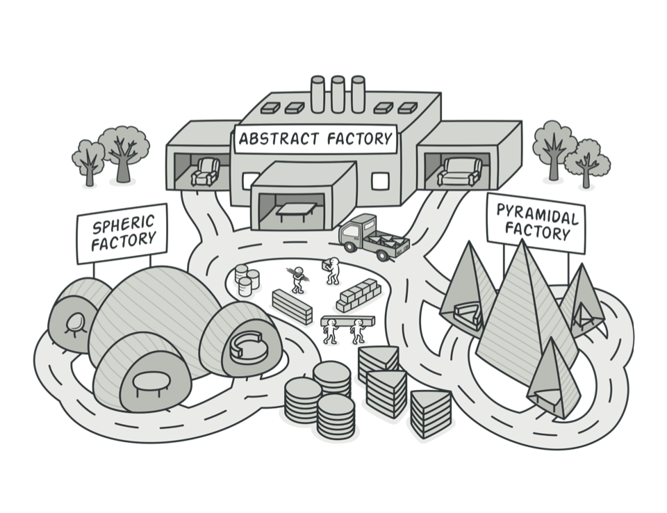

# 추상 팩토리 패턴

상세화된 서브클래스를 정의하지 않고도 `서로 관련성이 있거나 독립적인 여러 객체 군을 생성`하기 위한 인터페이스를 제공합니다.

하나의 애플리케이션이지만 두 버전의 룩앤필을 갖는 경우를 살펴보겠습니다. 서로 다른 룩앤필은 서로 다른 유저 인터페이스의 표현 방식과 액션을 갖습니다. 버튼의 모양, 버튼을 눌렀을 때의 동작도 다를 수 있습니다. 이 애플리케이션이 서로 다른 룩앤필에 상관없이 이식성을 가지려면, 구체 타입의 버튼을 사용하지 말고 추상 클래스를 이용해서 접근해야 합니다.

예를 들어, 무료 버전과 프리미엄 버전의 PostView가 있다면 인스턴스를 생성하는 팩토리와 구분하여 생성할 룩앤필에 대응하는 PostView 클래스를 인터페이스로 정의합니다. 그러고 나서 각 버전이 제공하는 UI나 동작 방식에 따라 FreetierPostView와 PremiumPostView를 정의합니다.

## 예제 코드

위의 예제를 활용하여 역할군을 나눠서 구현이 어떻게 되는지 보겠습니다.

#### AbstractFactory (PostViewFactory)

```swift

// AbstractFactory
protocol PostViewFactory {

    static func postView(for type: PostType) -> PostView
}
```

개념적 제품에 대한 객체를 생성하는 인터페이스를 정의합니다.

#### ConcreteFactory (FreetierPostViewFactory, PremiumPostViewFactory)

```swift

// ConcreteFactory
class FreetierPostViewFactory: PostViewFactory {

    static func postView(for type: PostType) -> PostView {
        switch type {
        case .edit: return FreetierPostEditView()
        case .detail: return FreetierPostDetailView()
        }
    }
}

class PremiumPostViewFactory: PostViewFactory {

    static func postView(for type: PostType) -> PostView {
        switch type {
        case .edit: return PremiumPostEditView()
        case .detail: return PremiumPostDetailView()
        }
    }
}
```

PostViewFactory를 따르고 각 인터페이스에 대한 구체 타입의 객체를 생성합니다.

#### AbstractProduct (PostView)

```swift

// AbstractProduct
protocol PostView {
    var onComplete: (() -> Void)? { get set }
}
```

개념적 Product에 대한 인터페이스를 정의합니다.

#### ConcreteProduct (FreetierPostEditView, FreetierPostDetailView, ...)

```swift

// ConcreteProduct
class FreetierPostEditView: UIView, PostView {
    var onComplete: (() -> Void)?

    /// Freetier-oriented features
}

class FreetierPostDetailView: UIView, PostView {
    var onComplete: (() -> Void)?

    /// Freetier-oriented features
}

class PremiumPostEditView: UIView, PostView {
    var onComplete: (() -> Void)?

    /// Premium-oriented features
}

class PremiumPostDetailView: UIView, PostView {
    var onComplete: (() -> Void)?

    /// Premium-oriented features
}
```

구체적으로 팩토리가 생성할 객체를 정의하고 AbstractProduct가 정의하는 프로토콜을 구현합니다.

#### Client

```swift

#if Freetier
    let factory = FreetierPostViewFactory.self
#else
    let factory = PremiumPostViewFactory.self
#endif

/// Client
// Create Edit view
var postEditView = factory.postView(for: .edit)
postEditView.onComplete = {
    // detach view
}

// Create Detail view
var postDetailView = factory.postView(for: .detail)
postDetailView.onComplete = {}
```

AbstractFactory와 AbstractProduct 인터페이스를 사용합니다.

구체 팩토리는 애플리케이션에서 한 번만 나타나기 때문에 다른 구체 팩토리로 변경하기가 쉽습니다. 또한, 구체 팩토리를 변경함으로써 애플리케이션은 서로 다른 프로덕트를 사용할 수 있게 됩니다.
