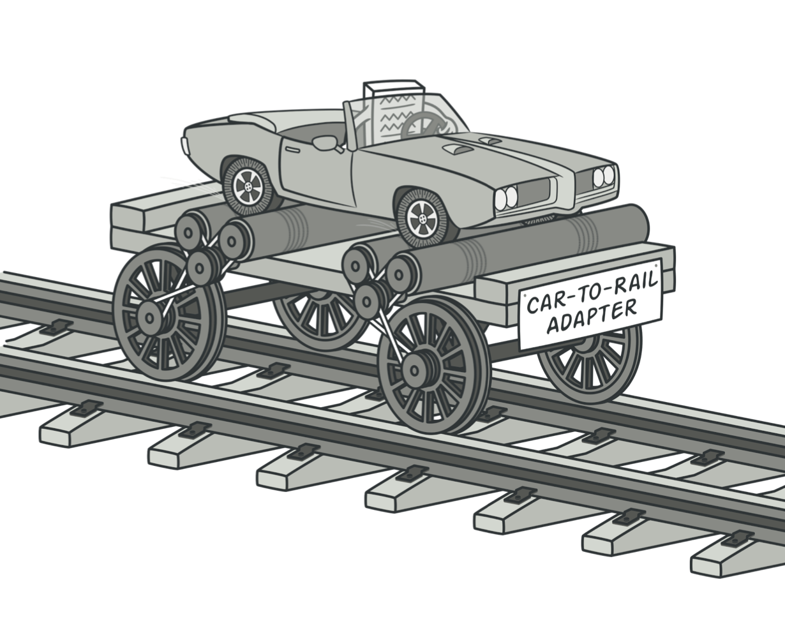
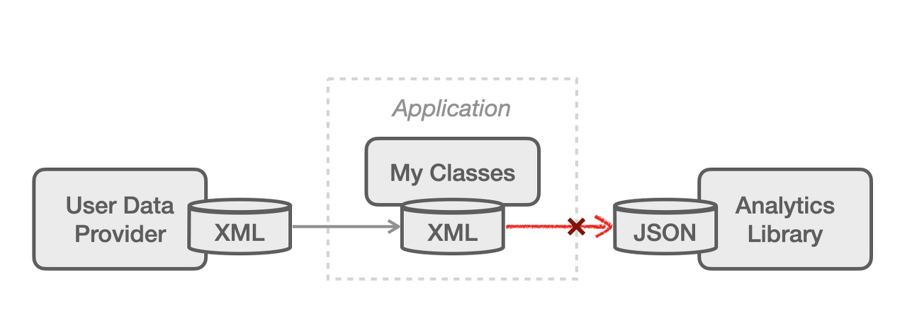
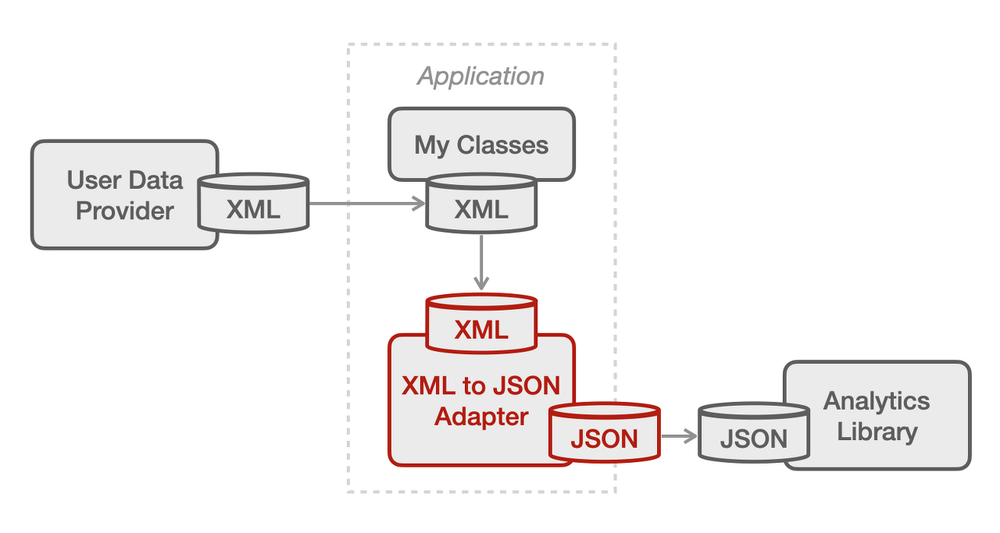
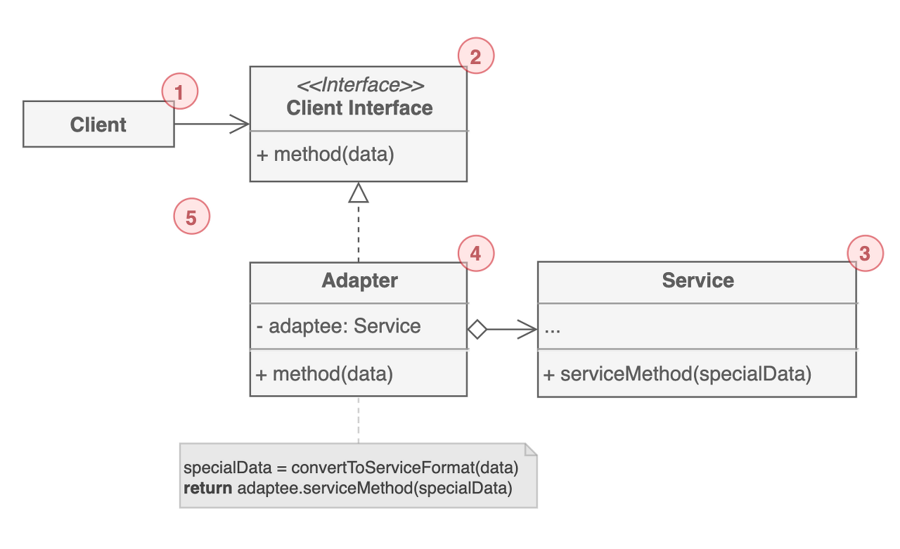

# 어댑터 패턴

상호 호환이 되지 않는 객체 간의 조화가 필요할 때 사용하는 구조 패턴이다. `Wrapper`라고도 불린다.

유저 데이터를 가공해서 지표를 분석하는 애플리케이션이 있다고 해보자. 유저 데이터 제공자는 모든 데이터의 포맷을 XML으로만 제공하고, 분석 라이브러리는 JSON 포맷으로만 입력값을 받을 수 있다면 데이터 포맷이 서로 '호환이 안되는' 문제가 발생한다.

이 지점에서 몇가지 선택지가 있다. 유저 데이터를 XML이 아닌 JSON으로 전달받거나 혹은 분석 라이브러리가 XML도 분석할 수 있게 변경하는 방식이다. 하지만 단순히 새로운 파일 확장자를 지원하기 위해서 라이브러리를 고치는 작업은 생각보다 큰 작업이 될 수도 있다. 게다가 써드파티라면 아예 그 작업이 불가능할 수도 있다.

이런 상황에서 사용하기에 가장 이상적인 것이 어댑터 패턴이다. 데이터 제공자나 분석 라이브러리를 수정하는 것이 아니라 애플리케이션에서 데이터 포맷을 변환하는 어댑터를 두는 것이다.

## 구조

1. Client는 `비즈니스 로직`을 포함한다.

2. Client에서 다른 클래스들과 함께 사용되기 위해서 따라야 하는 `인터페이스`를 정의한다.

3. 호환이 되지 않아 Client가 바로 사용할 수 없는 클래스(`써드파티 혹은 레거시`)이다. 

4. Adapter는 `Client와 Service를 연결`한다. Client Interface를 구현하고 Service를 랩핑한다.

5. 클라이언트 코드는 클라이언트 인터페이스를 통하기 때문에 구현체인 어댑터 클래스에 직접 연관을 맺지 않는다. 덕분에 기존 클라이언트 코드를 변경하지 않고 새로운 어댑터를 추가할 수도 있게 된다.

## 예제 코드
