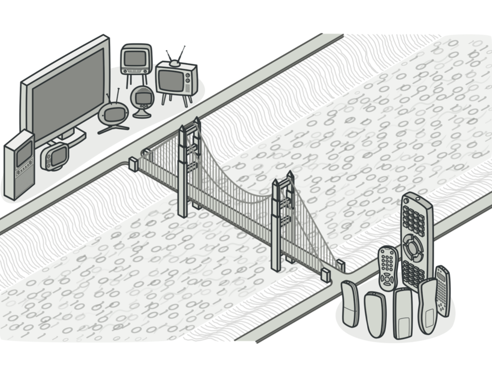
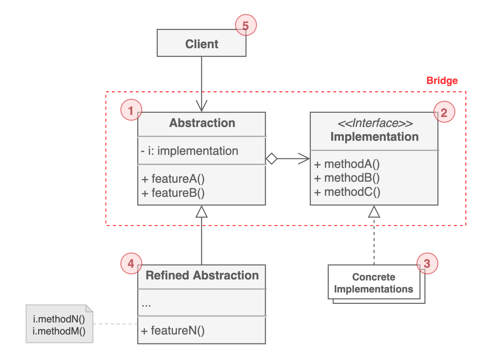

# 브릿지 패턴

`밀접하게 연관된 클래스의 집합을 따로 구분`하여 계층 구조를 갖도록 하는 구조 패턴이다. 

원격 조종장치(컨트롤러)를 필요로 하는 전자기기를 생각해보자. 전자기기들이 각각의 컨트롤러를 가지고 있다면 기기가 하나 늘어날 때마다 컨트롤러도 반드시 하나가 추가되어야 한다. 다시 말해, A라는 컨트롤러로 a기기만 사용할 수 있는 상황(1:1)이므로 확장성이 전혀 고려되지 않은 것이다.

브릿지 패턴의 아이디어는 여기에서 출발한다. 엄연히 다른 영역(기능)에 속하는 `컨트롤러와 기기를 분리`해서 A 컨트롤러로 a, b, c... 기기 모두를 제어(1:N)할 수 있게 하는 것이다.

## 구조

1. 추상화된 `컨트롤 로직`을 제공한다. low-level의 Implementation을 포함한다.

2. Concrete Implementations들의 `공통적인 기능을 정의`한다. Abstraction은 반드시 Implementation을 통해서만 구현체에 접근할 수 있다.

3. 특정 `플랫폼 혹은 환경에 특화된 코드`들을 포함한다.

4. 다양한 컨트롤러를 제공하기 위함이다. 선택적으로 상속을 하여 다른 기능을 제공할 수 있다.

5. `추상화된 기능을 사용`하는 것에 관심이 있는 대상이다. 

## 활용

-   추상적 개념과 구현 사이의 지속적인 종속 관계를 피하고 싶을 때 사용한다. 이를테면, 런타임에 구현 방법을 선택하거나 구현체를 변경하고 싶을 때
-   추상적 개념과 구현 모두가 독립적으로 서브클래싱을 통해 확장되어야 할 때

## 예제 코드