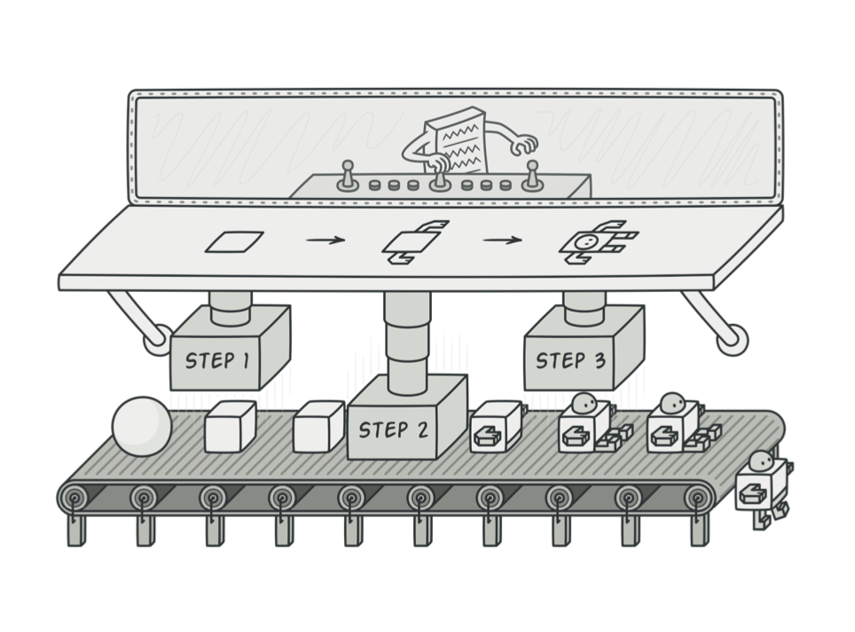

# 빌더 패턴

빌더 패턴은 복잡한 객체의 생성을 위한 클래스를 별도로 분리해서 생성을 돕는 동시에 표현을 동일하게 제공하기 위해 사용합니다.

[**GoF**](https://en.wikipedia.org/wiki/Design_Patterns)에서는 문서 판독기를 예를 들어 설명하고 있습니다. 문서 판독기는 RTF(Rich Text Format) 포맷에서 다른 포맷으로 바꿀 수 있어야 합니다. RTF 문서를 HTML 포맷이나 MD(Markdown) 포맷으로 바꾼다고 가정해 봅시다. 여기서 문제는 문서의 형식들 간의 변환이 자유로워야 하고, 판독기의 변경 없이도 새로운 포맷으로의 변환이 가능해야 한다는 것입니다.

이 경우에 RTF를 다른 포맷으로 변경하는 역할을 담당하는 TextConverter와 TextReader를 구분 지어 생각할 수 있습니다.  
TextReader는 텍스트를 입력받아 TextConverter를 통해 원하는 형태의 포맷으로의 변환을 요청하게 됩니다.

## 예제 코드

위의 예제를 활용하여 역할군을 나눠서 구현이 어떻게 되는지 보겠습니다.

#### Builder (TextConverterBuilder)

```swift
// Builder
protocol TextConverterBuilder {
    var text: String? { get }
    var formatter: Formatter? { get }

    func setText(text: String) -> Self
    func setLocale(locale: Locale) -> Self
    func convert() -> Content
}
```

Content 객체 요소들을 생성하기 위한 프로토콜을 정의합니다.

#### ConcreateBuilder (HTMLConverterBuilder, MDConverterBuilder)

```swift
// ConcreateBuilder
class HTMLConverterBuilder: TextConverterBuilder {
    var text: String?
    var formatter: Formatter?

    func setText(text: String) -> Self {
        self.text = text
        return self
    }

    func setLocale(locale: Locale) -> Self {
        self.formatter = Formatter(locale: locale)
        return self
    }

    func convert() -> Content {
        HTMLConverter(formatter: formatter)
            .createContent(text: text)
    }
}

class MDConverterBuilder: TextConverterBuilder {
    var text: String?
    var formatter: Formatter?

    func setText(text: String) -> Self {
        self.text = text
        return self
    }

    func setLocale(locale: Locale) -> Self {
        self.formatter = Formatter(locale: locale)
        return self
    }

    func convert() -> Content {
        MDConverter(formatter: formatter)
            .createContent(text: text)
    }
}
```

TextConverterBuilder 프로토콜을 구현하며, 필요 요소들을 모아 빌더를 복합합니다. Content 생성을 위한 인터페이스를 제공합니다.

#### Director (TextReader)

```swift
// Directer
class TextReader {
    let converterBuilder: TextConverterBuilder

    init(_ converterBuilder: TextConverterBuilder) {
        self.converterBuilder = converterBuilder
    }

    func convert(text: String) -> Content {
        converterBuilder
            .setText(text: text)
            .setLocale(locale: Locale())
            .convert()
    }
}
```

TextConverterBuilder 프로토콜을 사용하는 객체입니다.

#### Product (Content)

```swift
// Product
struct Content {
    let text: String
    let timestamp: Date
}
```

생성할 객체를 표현합니다. 구체 빌더 클래스는 Content 생성을 위한 속성들을 만들고 그 절차들을 정의합니다.

그 외 구체 클래스와 사용 예제

```swift

class HTMLConverter: TextConverter {
    let formatter: Formatter

    init(formatter: Formatter?) {
        self.formatter = formatter ?? Formatter.standard
    }

    func createContent(text: String?) -> Content {
        // Converts text to html format content
        return Content(...)
    }
}

class MDConverter: TextConverter {
    let formatter: Formatter

    init(formatter: Formatter?) {
        self.formatter = formatter ?? Formatter.standard
    }

    func createContent(text: String?) -> Content {
        // Converts text to html format content
        return Content(...)
    }
}


let textReader = TextReader(HTMLConverterBuilder())
let content: Content = textReader.convert(text: "text reader")

```

#### Content (Product)에 대한 프로토콜은 필요 없을까?

일반적으로 Product는 구체화된 빌더 클래스에서 제공하는데, Product마다 공통점이 없을 수도 있을뿐더러 인터페이스를 제공한다 하더라도 얻을 수 있는 장점이 없기 때문에 굳이 제공할 필요가 없다.