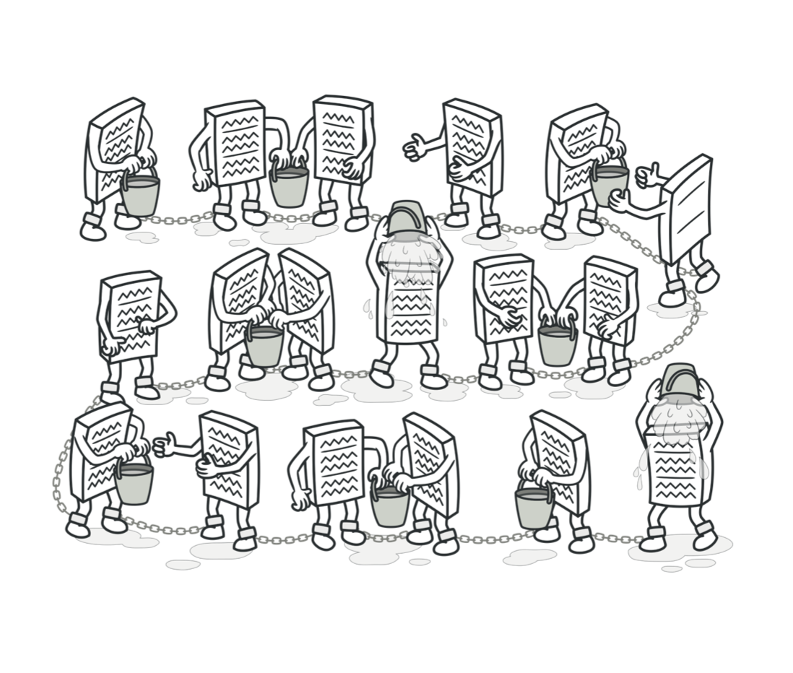
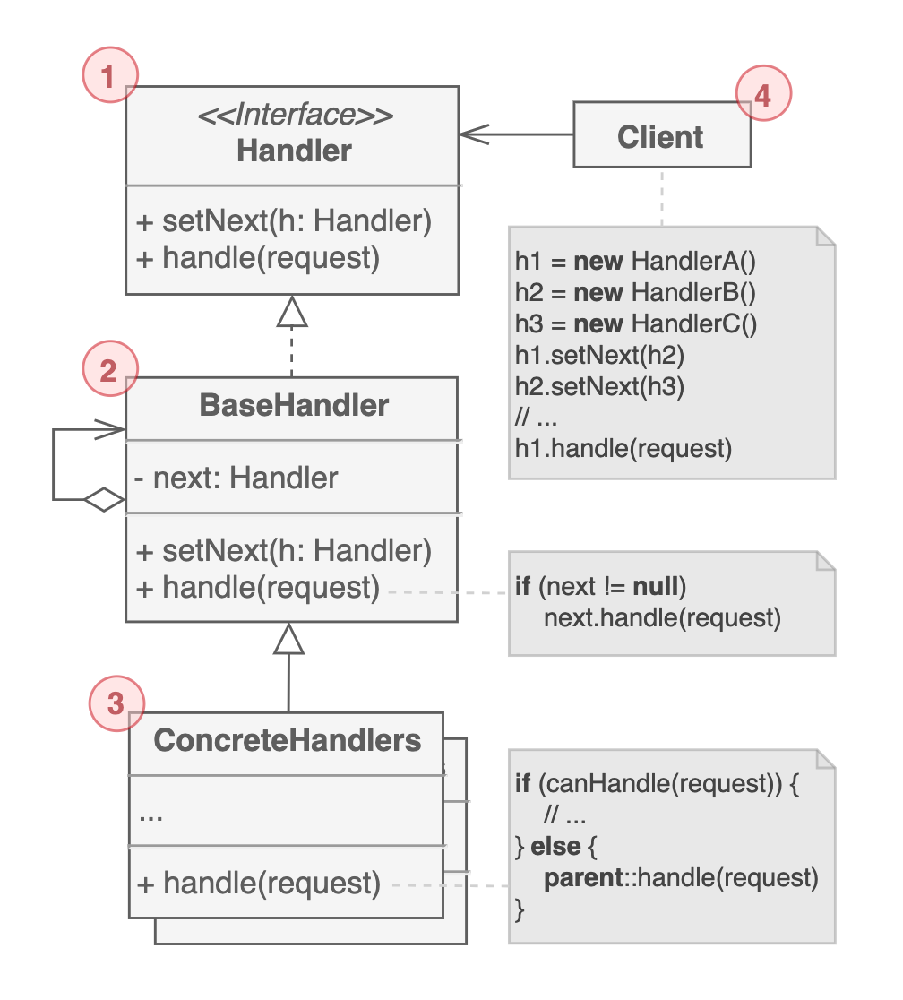

# 책임 연쇄 패턴

연속적인 핸들러를 따라 요청을 전달하도록 하는 행동 디자인 패턴이다. 요청을 받으면 핸들러는 요청을 처리하거나 다음 핸들러로 요청을 전달한다. CoR 혹은 Chain of Command라고도 불린다.

## 구조

1. 모든 구체 핸들러의 `공통 인터페이스`를 선언한다. 일반적으로 요청을 처리하기 위한 단일 메서드만 포함하지만 필요에 따라서 다음 핸들러를 설정하기 위한 메서드를 추가한다.

2. 보일러 플레이트 코드가 들어가는 `기본 핸들러 클래스`이다. 다음 핸들러에 대한 참조를 갖고 있다. 필수는 아니다.

3. 요청을 처리하기 위한 실제 `로직을 포함`한다. `요청을 처리할지 다른 핸들러에게 전달할지 여부를 결정`해야 한다. 독립적이며 불변으로 만든다. 필요한 모든 데이터는 생성자를 통해 한번만 전달받는다.

4. 핸들러 체인을 생성한다. 동적으로 다시 생성할 수도 있다.

## 예제 코드