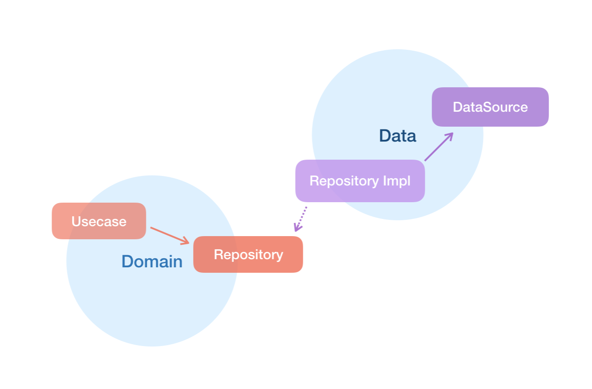

> 아키텍처를 위해 투쟁하라. — Robert C. Martin의 클린 아키텍처 중

## 소프트웨어와 아키텍처

소프트웨어software라는 단어에 나타나듯이 `부드러운soft`과 `제품ware`이라는 의미를 가진 것이 소프트웨어이다. 소프트웨어를 만드는 이유는 행위(기능)를 쉽게 변경할 수 있도록 하기 위해서다. 기억해야 할 것은 소프트웨어의 첫 번째 가치가 `행위behavior`라면 두 번째 가치는 `아키텍처`이다. 

사용자 입장에서야 바꾸기 쉬운지는 하나도 중요하지 않다. 어떤 기능을 제공하는지가 소프트웨어를 사용하는 이유이기 때문에, 우리는 행위에 집중해왔다. 하지만 소프트웨어가 가진 본연의 목적을 추구하려면 반드시 부드러워야 한다. 변경하기 쉬워야 한다는 뜻이다. 개발자라면 적어도 겨우 기능이 동작하는 소프트웨어를 만드는 게 최종 목표가 되어서는 안 된다.

## 클린 아키텍처

Photo by clean architecture

Robert C. Martin이 얘기한 [클린 아키텍처](https://blog.cleancoder.com/uncle-bob/2012/08/13/the-clean-architecture.html)이다. 아키텍처는 한두 가지의 절대적인 원칙을 가지고 설계되는 것은 아니지만 잊지 말아야 할 여러 원칙들은 존재한다. 순환구조를 만들지 마라, 구체적인 것에 의존하지 마라, 세부사항은 무시하라.

내가 생각하는 가장 중요한 것은 `의존성 규칙`이다. 위 이미지에선 밖으로 갈수록 Web, DB 등 기술에 가깝고, 안으로 갈수록 비즈니스 규칙에 가깝다. 다른 말로, 외부에서 내부로 들어갈수록 고수준이 된다. 우리는 되도록이면 `Web, DB 같은 구체적인 것은 떼어내고 비즈니스를 독립적으로 분리`해야 한다. 그렇기 때문에 의존성의 방향이 외부에서 내부로 향하도록 만들어야 한다.

## MovieBook

영화 목록을 보여주고 즐겨찾기가 가능한 MovieBook이라는 앱을 만들 것이다. 처음 앱의 설계와 기능 추가, 테스트 코드를 점진적으로 작성하면서 클린 아키텍처를 iOS 앱에 적용해 볼 것이다.

## 프로젝트 구성하기

클린 아키텍처는 크게 3개 계층으로 구분된다. 화면에 해당하는 `UI`, 비즈니스 규칙이 들어갈 `Domain`, 데이터가 저장된 `Data`. 이 구조를 따라 앱을 설계할 것이다.

MovieBook 프로젝트를 생성한 뒤 영화 서비스를 추가하기 위해서 Movie 프레임워크를 추가하였다. 여기서 프레임워크로 분리하는 것은 중요하다. 물리적으로 완전히 분리시켜야 의도치 않은 잘못된 접근을 막을 수 있다.

타겟으로 `Movie`, `MovieUI`, `MovieData`, `MovieDomain`으로 분리하였다. 모듈 간에 의존성을 설정할 때 구체적인 것에 의존하지 않고 설계하는 것은 굉장히 중요하다. 그렇다고 구체 클래스에 어떠한 코드도 접근해선 안 되는 것은 아니다. 대부분의 언어에서 객체를 생성하려면 구체 클래스에 의존성이 발생하기 때문이다. `Movie`는 이러한 의존성을 처리하기 위해 `추상 팩토리`로 사용한다.

## UI

`UIKit` 혹은 `SwiftUI`(사용자 인터페이스)에 의존하는 유일한 모듈이 되어야 한다. UIKit으로 개발된 화면이 다른 계층(비즈니스 규칙, 데이터)와 완전하게 분리되어 있다면, 언제든 SwiftUI로 전환할 수 있을 것이다.

## Domain

핵심 `비즈니스 규칙`만 포함할 것이다. 그리고 다른 계층들과 `완전히 독립적`이다. 유스케이스는 사용자 관점에서의 기능(비즈니스 규칙)을 캡슐화한 클래스이다.

도메인 계층을 다른 계층과 완전히 독립적으로 만들기 위해서는 `의존성 역전`이라는 중요한 개념이 필요하다. Repository는 Domain과 Data에 걸쳐서 존재하기 때문에 색을 섞어서 표현했다.

Domain은 Repository에 대해 구체적으로 알고 있지 않다. Repository에 대한 인터페이스만 정의하고 실제 구현은 Data 계층에서 하게 된다. 이 지점에서 제어흐름과 코드의 의존성이 반대 방향이 된다. 이 원리를 `의존성 역전(Dependency Inversion)`이라고 부른다.

## Data

`구체 Repository`와 `DataSource`로 구성된다. DataSource는 외부(API) 데이터와 내부(캐시, 디비) 데이터로 되어있고 Repository 구현체는 API 데이터를 반환할지, 캐시 데이터를 반환할지를 결정한다.

## Next.. 👋

앱 기본 구조를 갖추면서 가장 독립적인 `Domain` 계층부터 구현할 것이다. 그리고 테스트를 위해서 다소 유명하진 않지만 굉장히 유용한 Mocking 프레임워크인 [Cuckoo](https://github.com/Brightify/Cuckoo)를 사용해 볼 것이다. 

- 전체 코드 [Github](https://github.com/hb1love/MovieBook/tree/clean-architecture-1)