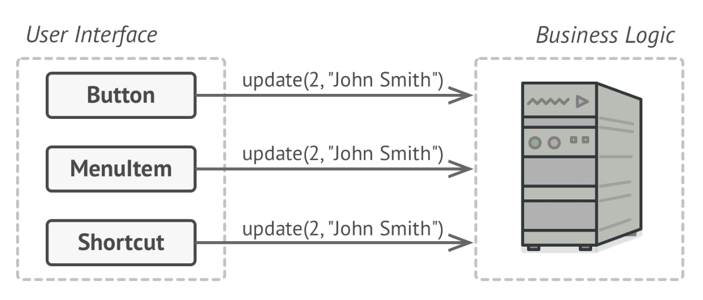

# 커맨드 패턴

`요청에 대한 모든 정보를 담고 있는 독립적인 객체로 요청을 변환`하는 행동 디자인 패턴이다. 이 방법으로 서로 다른 요청으로 메서드를 매개변수화하고, 요청 실행을 지연하거나 큐에 쌓을 수도 있다. 실행 취소 기능을 지원할 수도 있다.

텍스트 편집기를 만들고 있다고 가정해보자. 나의 임무는 다양한 작업을 위한 버튼들이 있는 툴바를 만드는 것이다.  
자! 툴바 버튼이나 다른 대화 상자에도 사용할 수 있는 Button 클래스를 만들었다.

툴바에 있는 버튼들은 다 비슷하게 생겼지만 눌렀을 때의 동작은 모두 제각각이다. 그렇다고 하면 이 버튼의 클릭 핸들러에 대한 코드를 어디에 배치하는 것이 좋을까? 가장 간단한 방법은 버튼이 사용되는 곳에 서브 클래스를 만들고 이 서브 클래스에 버튼이 클릭되었을 때 실행되어야 하는 코드를 포함시키는 방법이다. 

이 방식은 너무 많은 서브클래스가 만들어지고, 기본 Button 클래스를 수정할 때마다 서브 클래스의 코드가 깨질 위험이 있기 때문에 좋은 방식은 아니다.

저장이나 복사/붙여넣기 같은 `일부 기능은 여러 위치에서 호출되기 때문에 한 기능이 여러 클래스에 구현되는 문제`가 발생한다. 위에서처럼 툴바만 있는 경우에는 SaveButton안에 기능에 대한 코드가 있어도 나쁘지 않다고 할 수 있지만, 컨텍스트 메뉴, 단축키 옵션 등이 추가된 상태에서는 저장 관련 코드를 그대로 복사하거나 SaveButton을 다시 상속받아야 하기 때문에 굉장히 나쁜 구조가 된다.

좋은 설계는 거의 [SoC](https://ko.wikipedia.org/wiki/%EA%B4%80%EC%8B%AC%EC%82%AC_%EB%B6%84%EB%A6%AC)를 전제로 하고 있다. 그렇기 때문에 보통 앱을 여러 개의 계층으로 나눈다. 일반적인 예로, UI 계층과 비즈니스 로직 계층으로 분리하는 것이다. 지금까지의 예제를 표현하면 아래 그림과 같다.

커맨드 패턴은 `UI 객체가 이러한 요청을 직접 보내지 않아야 한다`는 걸 말해준다. 대신, 호출되는 객체나 메서드 및 파라미터 같은 `모든 세부 사항을 담는 새로운 커맨드 클래스로 추출`해야 한다.

이제는 UI 객체는 어떤 비즈니스 로직 객체가 요청을 받고 어떻게 처리하는지에 대해 알 필요가 없어진다.

## 구조

1. `요청을 시작`하는 클래스이고 커맨드 객체에 대한 참조를 갖고 있다. 수신자에게 요청을 직접 보내는 대신 해당 `커맨드를 트리거`한다. 일반적으로 커맨드 객체를 직접 생성하진 않고 생성자를 통해서 전달받는다.

2. 커맨드를 실행하기 위한 단일 메서드만 선언한다.

3. 다양한 종류의 커맨드를 구현한다. 구체적인 커맨드는 자체적으로 작업을 수행하는 것이 아니라 `비즈니스 로직 계층으로 요청을 전달`한다. 수신자의 메서드를 실행하는데 필요한 매개변수는 모두 생성자를 통해서 전달받는다.

4. `비즈니스 로직`이 포함되어 있으며 모든 객체가 수신자 역할을 할 수 있다. 대부분의 커맨드는 수신자에게 전달되는 방법에 대한 세부사항만 처리하고 수신자는 실제 작업을 수행한다.

5. 커맨드를 생성하고 구성하는 역할을 한다. 수신자 인스턴스를 포함한 모든 매개변수를 커맨드의 생성자로 전달한다.

## 예제 코드