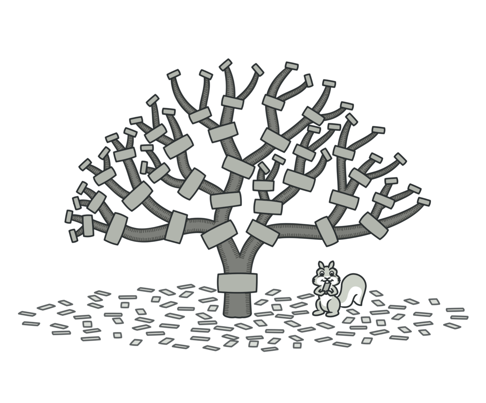
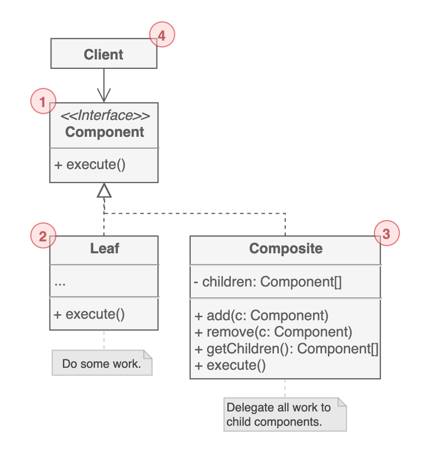

# 컴포지트 패턴

객체들의 `관계를 트리 구조로 구성해서 부분-전체 계층을 표현`하는 구조 패턴이다. 단일 객체와 복합 객체 모두 동일한 컴포넌트로 다룬다. `Object Tree`라고도 표현한다.

제품을 상자에 포장하는 경우를 떠올려보자. 상자는 제품을 넣을 수 있고, 그 안에 또 다른 상자가 들어갈 수도 있다. 겹겹이 상자가 들어갈 수 있다는 것이다. 그 경우에, 모든 제품의 가치(가격)를 새고 싶다면 어떻게 해야 할까?

컴포지트 패턴은 이 물음에서 시작한다. 현실세계라면 아주 쉽다. 그냥 박스를 풀어서 모든 제품의 가격을 확인한 다음에 더하면 될 것이다. 하지만 프로그램 안으로 들어오면 단순히 반복문을 실행하는 것만큼 간단하진 않다. 상자들의 타입(클래스)을 확인해야 할 것이고, 중첩이 얼마나 되었는지, 기타 세부사항에 대한 확인이 필요하기 때문이다.

이럴 때 상자와 제품의 가격을 확인하고 반환하는 공통 인터페이스를 선언한다. 제품의 경우 단순히 제품 가격을 반환한다. 상자는 상자에 포함된 모든 제품 + 상자에 가격을 요청하고 합계를 반환한다. 이러한 행위가 전체 컴포넌트들에 반복적으로 실행됨으로써 전체 가격을 측정할 수 있다.

## 구조

1. Component는 단일 객체(제품)와 복합 객체(상자)의 `공통적인 연산`을 정의한다.

2. 하위 요소가 없는 트리의 기본 요소이다. 더 이상 하위 요소가 없기 때문에 `실질적인 연산을 수행`한다.

3. 다른 컴포넌트를 포함하기 때문에 `Container`라고도 불린다. 동작을 직접 수행한다기보단 하위 요소들에게 `연산을 위임`하고 결과만 받아서 반환하는 역할을 한다.

4. `Component 인터페이스를 통해 모든 요소들과 연결`된다. 결과적으로 복잡한 Component건 단순한 Component건 상관없이 동일한 방식으로 동작한다.

## 예제 코드