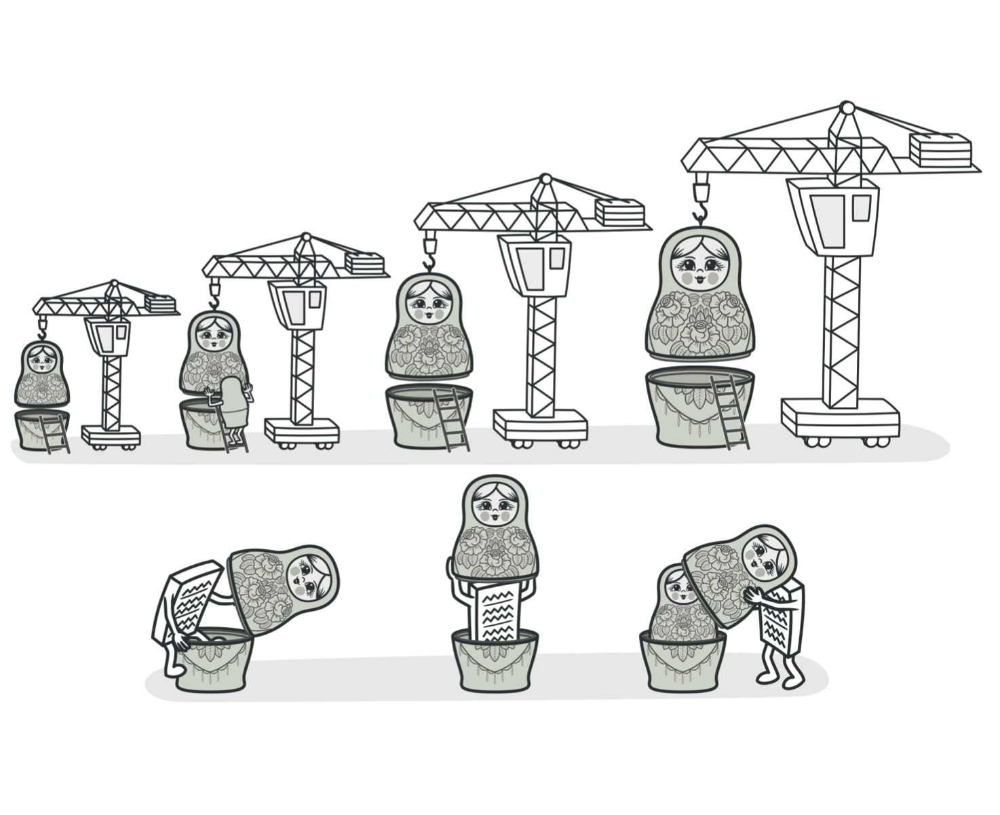
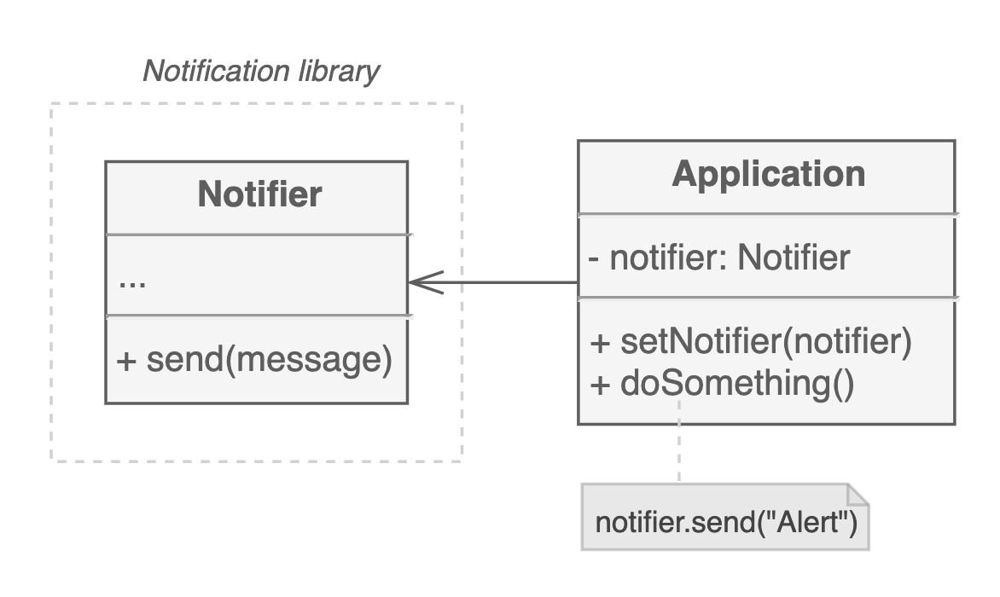
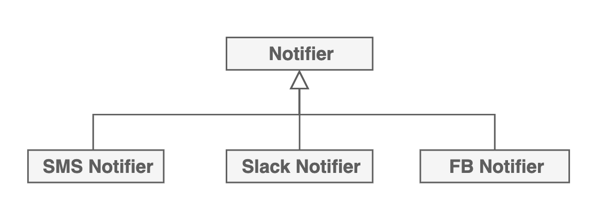
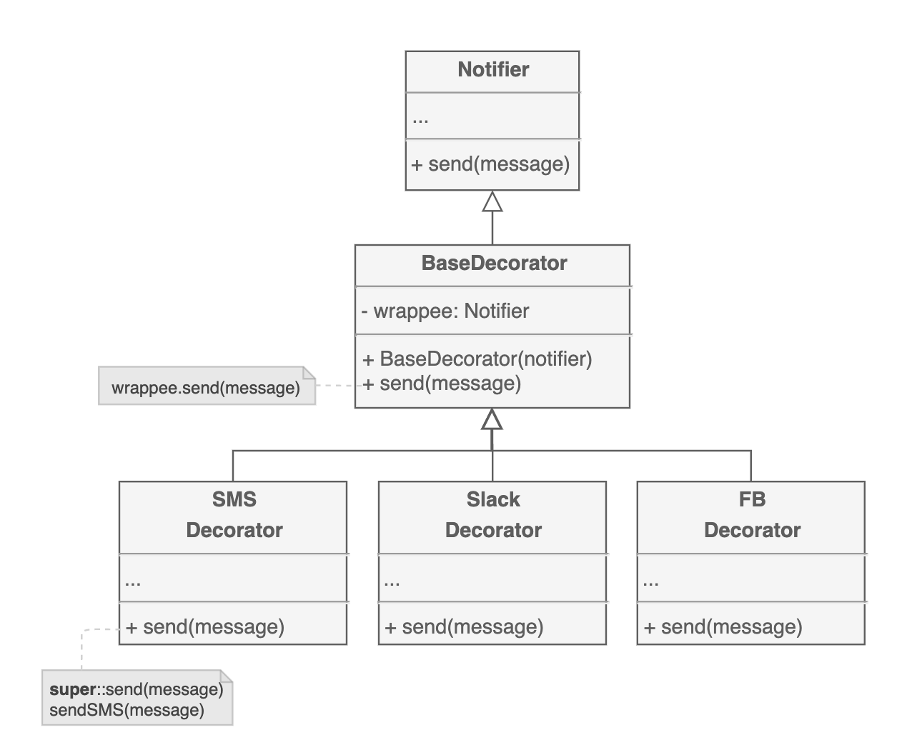
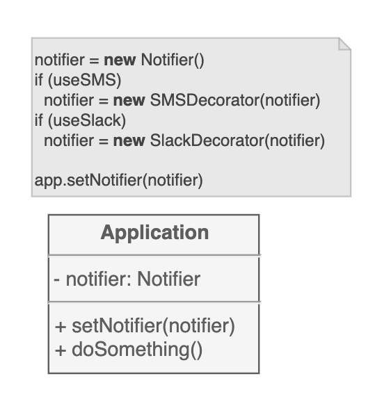
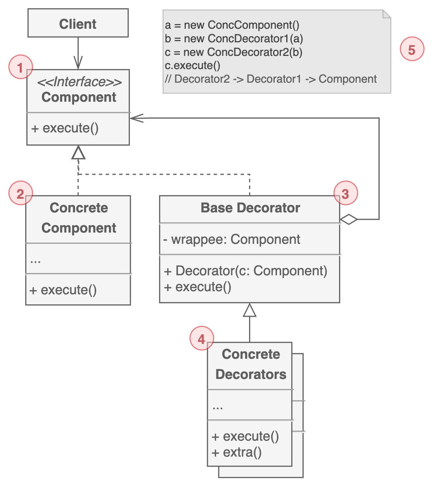

# 데코레이터 패턴

새로운 행위를 하는 객체를 기존의 객체로 포장하는 방법이 데코레이터 패턴이다. 구조 패턴에 속하며, 어댑터 패턴처럼 Wrapper 패턴이라고도 불린다.

사용자에게 알림을 보내는 시스템을 생각해보자. 초기 모델 라이브러리에는 이메일로 알림을 받길 원해서 아래처럼 단순히 프로퍼티 몇 개와 메시지를 전송하는 메서드 하나 밖에 없었다.

하지만 나중엔, 좀 더 긴박한 상황에서 SMS나 메신저로 알림을 받길 원해서 라이브러리를 확장해야 하는 요구가 생겼다. 한가지 대안으로 상속을 떠올려볼 수 있다.

각 채널에 대한 클래스를 따로 만들어서 필요한 기능들을 클래스에 포함시키도록 만들었다. 하지만, 한 가지 채널이 아니라 여러 개의 채널을 통해서 알림을 받고싶으면 상속으로 해결할 수 있을까? 각 채널들의 조합을 모두 클래스로 만들어야 하기 때문에 사실상 불가능에 가깝다고 봐야한다.

데코레이터 패턴에서 이 문제를 해결하는 방법은 집합(Aggregation)관계를 이용하는 것이다.

기본 이메일 알림 클래스는 그대로 둔 채로 다른 알림을 모두 데코레이터로 바꾸었다. 클라이언트 코드에서는 기본 Notifier 클래스를 생성한 뒤 필요한 데코레이터를 랩핑할 수 있다. 

## 구조

1. 랩퍼와 랩핑된 객체의 `공통 인터페이스`를 나타낸다.

2. 랩핑된 객체 클래스이다. 데코레이터가 변경할 수 있는 `기본 동작을 정의`한다.

3. 래핑된 객체를 프로퍼티로 가지고 있다. 프로퍼티는 `구체 컴포넌트와 데코레이터를 모두 포함`할 수 있도록 Component 인터페이스로 선언한다.

4. 구체 데코레이터는 컴포넌트에 `동적으로 추가할 수 있는 동작을 정의`한다. Base Decorator의 메서드를 재정의하고 부모 메서드를 호출하기 전이나 후에 동작을 수행한다.

5. 클라이언트는 다른 동작을 하는 데코레이터를 `여러 번 랩핑`할 수 있다.

## 예제 코드

## 관련 패턴

데코레이터를 일종의 어댑터 패턴으로 볼 수도 있다. 어댑터는 기존 객체의 인터페이스를 변경시켜주는 것이지만 데코레이터는 인터페이스를 변경하지 않고 행동을 변화시킨다.