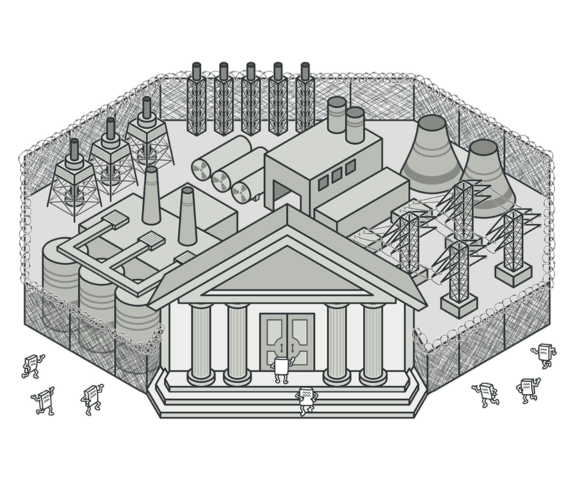

# 퍼사드 패턴

라이브러리, 프레임워크나 복잡한 클래스들(이하 서브시스템)의 단순화된 인터페이스를 제공하기 위해 사용하는 구조 패턴이다. 

서브시스템을 사용할 때 복잡한 초기화, 의존관계 설정 혹은 정해진 순서로 메서드를 호출해줘야 하는 경우가 있다. 이때 애플리케이션의 비즈니스 로직과 서브시스템의 결합도가 높아져서 유지보수 비용이 증가하게 된다.

퍼사드는 클라이언트의 관심사만 인터페이스로 분리해서 제공하는 방법을 사용한다.

## 구조

1. `서브시스템 기능을 편리하게 사용`할 수 있도록 한다. 클라이언트가 접근하는 부분과 서브시스템을 작동하는 방법을 모두 알고 있다.

2. 1번과 연관되지 않은 기능은 다른 퍼사드로 분리한다. 다른 퍼사드에서 사용할 수도 있고 클라이언트에서 직접 접근할 수도 있다.

3. 수십 가지 라이브러리 혹은 클래스들로 구성된다. 서브시스템은 퍼사드의 존재를 알지 못한다.

4. 서브시스템에 직접 접근하는 대신 퍼사드를 사용한다.

## 예제 코드