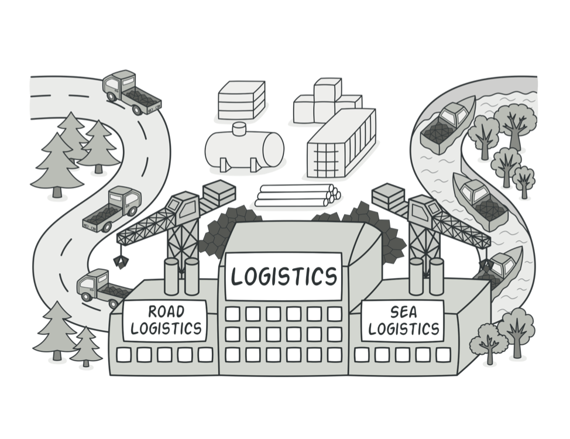

# 팩토리 메서드 패턴

객체를 생성하기 위해 인터페이스를 정의하지만, 어떤 클래스의 인스턴스를 생성할 지에 대한 결정은 서브클래스가 내리도록 합니다.

팩토리 메서드는 직접 인스턴스를 생성하는 대신 생성을 위한 메서드를 인터페이스로 제공합니다. 서브 클래스는 생성될 객체의 클래스를 변경하기 위해서 메서드를 재정의 할 수 있습니다.

프레임워크는 추상 클래스를 사용해서 객체 간의 관계를 정의할 수 있습니다. 또한 객체를 생성할 책임도 지닙니다. 이들 추상 클래스 간의 상호작용을 책임져서 전체 시스템의 기본 동작 방식을 정의합니다.

## 예제 코드

데이터베이스를 표현하는 애플리케이션 프레임워크가 있다고 해보겠습니다. 일단 두 개의 큰 추상화가 필요합니다. 하나는 **DatabaseFactory**(gof에서는 application이라고 표현하고 있습니다.)이고, 다른 하나는 **Database**입니다. 모두 프로토콜(추상 클래스)이고 종속적인 구현을 위해 해당 프로토콜을 따르는 클래스를 정의할 수 있습니다.

예를 들어, SQLite와 관련된 코드를 작성할 때는 **SQLiteFactory** 클래스와 **SQLite** 클래스를 정의해야 합니다. SQLiteFactory는 SQLite를 관리하는 책임을 가지고, 필요할 때 데이터베이스를 생성하기도 합니다. 

#### Product (Database)

```swift

// Product
protocol Database {
    var id: String { get }

    func select() -> [Event]
    
    func insert(item: Event)

    func sync(with items: [Event])
}

extension Database {
    func sync(with items: [Event]) {
        // do sync
    }
}
```

팩토리 메서드가 생성하는 객체의 인터페이스를 정의합니다.

#### ConcreteProduct (SQLite, Realm)

```swift

// ConcreteProduct
class SQLite: Database {
    var id = "sqlite"

    func select() -> [Event] {
        // request select query to sqlite
        return items
    }

    func insert(item: Event) {
        // request insert query to sqlite
    }
}

class Realm: Database {
    var id = "realm"

    func select() -> [Event] {
        // request select query to realm
        return items
    }

    func insert(item: Event) {
        // request insert query to realm
    }
}
```

Product 클래스에 정의된 인터페이스를 실제로 구현합니다.

#### Creator (DatabaseFactory)

```swift

// Creator
protocol DatabaseFactory {
    func create() -> Database

    func createSynced(with database: Database) -> Database
}

extension DatabaseFactory {
    func createSynced(with database: Database) -> Database {
        let newDatabase = create()
        newDatabase.sync(with: database.select())
        return newDatabase
    }
}
```

Product 타입의 객체를 반환하는 팩토리 메서드를 선언합니다. Creator를 따르는 클래스는 create() 메서드를 통해 ConcreteProduct 객체를 반환합니다.

#### ConcreteCreator (SQLiteFactory, RealmFactory)

```swift

// ConcreteCreator
class SQLiteFactory: DatabaseFactory {
    func create() -> Database {
        SQLite()
    }
}

class RealmFactory: DatabaseFactory {
    func create() -> Database {
        Realm()
    }
}
```

팩토리 메서드를 구현합니다.

그 외 구체 클래스와 사용 예제

```swift

class MyLocalDataSource {

    let eventDatabase: Database

    init(databaseFactory: DatabaseFactory) {
        self.eventDatabase = databaseFactory.create()
    }

    func allEvents() -> [Event] {
        eventDatabase.select()
    }

    func newEvent(event: Event) {
        eventDatabase.insert(item: event)
    }
}


let dataSource = MyLocalDataSource(databaseFactory: RealmFactory())
dataSource.newEvent(event: Event())
```
