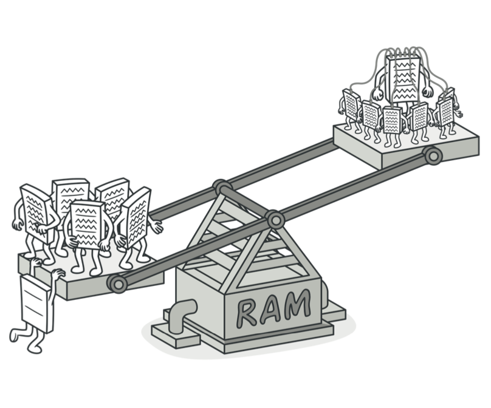
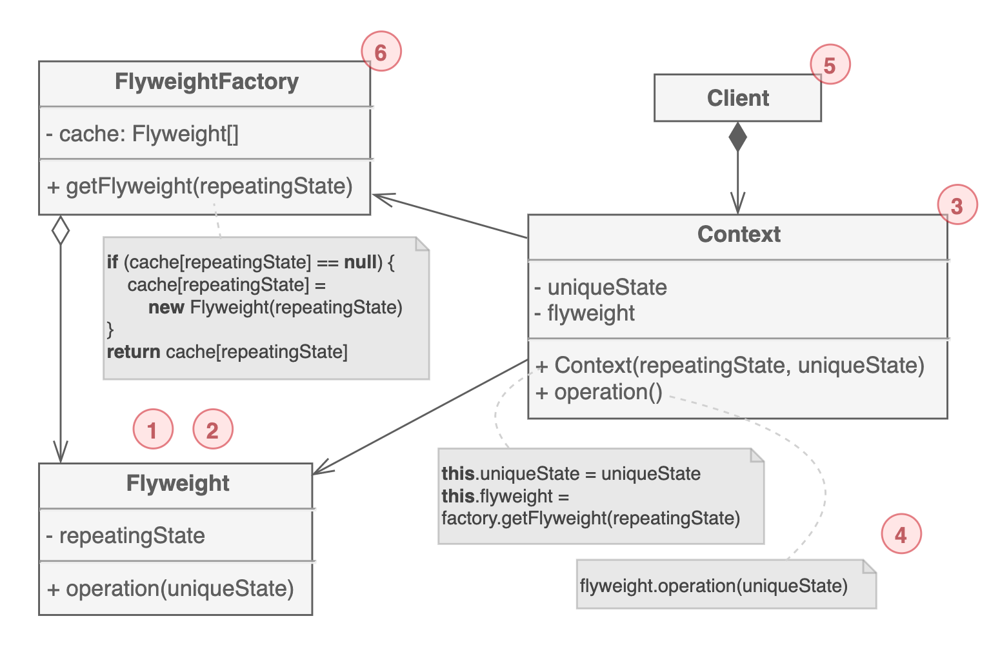

# 플라이웨이트 패턴

모든 객체를 개별적으로 생성하고 유지하는 대신 `공통으로 사용 가능한 부분을 공유`하여 `리소스(메모리)를 절약`하는 구조 패턴이다. 흔히 `캐시`라고 불린다.

## 구조

1. 플라이웨이트 패턴은 `단지 최적화`일 뿐이다. 애플리케이션에서 많은 수의 유사한 객체를 메모리에 저장하고 있다면, 플라이웨이트 패턴 적용을 고려해볼 수 있다.

2. 플라이웨이트 클래스에는 `여러 객체간에 공유할 수 있는 기존 객체의 상태 일부`가 포함된다. 여러 상황에서 동일한 객체를 사용할 수 있다. 플라이웨이트 안에 저장된 상태를 "intrinsic"(내부), 전달되는 상태를 "extrinsic"(외부)라고 부른다.

3. Context는 객체들의 `고유한 외부 상태(uniqueState)`를 가지고 있다. 외부 상태를 가진 Context와 플라이웨이트 객체가 결합이 되었을 때, 원래의 객체가 된다.

4. 일반적으로 기존 객체의 동작은 플라이웨이트 클래스 내부에 유지되고, 메서드를 호출하는 지점에 외부 상태를 파라미터로 전달해야 한다.

5. 클라이언트는 플라이웨이트의 `외부 상태를 계산하거나 저장`한다. 클라이언트의 입장에서 플라이웨이트는 `런타임`에 설정 구성이 가능한 템플릿 객체이다.

6. 기존 `플라이웨이트 풀을 관리`한다. 클라이언트는 플라이웨이트를 직접 생산하지 못한다. 팩토리를 통해서만 생성이 가능하다.

## 예제 코드