여러 앱에서 동일한 코드를 사용할 때 좀 더 효율적으로 공유하기 위한 방법이 무엇일까 생각해보았습니다. 

랩 전체가 공통적으로 사용하고 있는 유틸성 모듈은 현재 **Internal pods**으로 배포해서 공유하고 있습니다. 곧 **SPM**으로도 지원할 예정이구요. 

고민거리는, **동일한 브랜드의 앱에서만 공유하는 코드**를 어떻게 관리할 지 입니다. 서비스 A가 앱 B와 C로 나뉘어 있을 때 공통 코드를 Internal pods으로 공유하면 코드가 변경될 때마다 pod update를 해줘야 하는 불편함을 겪고 싶지 않았습니다.. 😣 그러던 도중에 Git Submodule로 관리하면 어떨까 생각이 들어서 기술조사 겸! 간단한 리뷰 들어갑니다. 

## Git Submodule

**Git 저장소 안에 다른 Git 저장소를 디렉터리로 분리해 넣는 것**이 서브모듈입니다. 다른 독립된 Git 저장소를 클론 해서 내 Git 저장소 안에 포함할 수 있으며 각 저장소의 커밋을 독립적으로 관리합니다.

간단하게 테스트 앱을 만들어서 사용해보겠습니다.

### 프로젝트에 서브모듈 추가하기

우선 메인 프로젝트인 **TestApp1**과 서브모듈 **TestSubmodule**을 생성하고 각각 저장소를 만들었습니다.

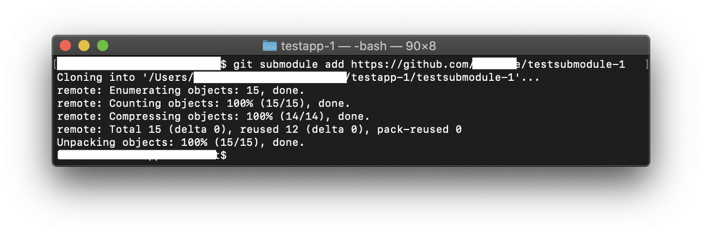

**TestApp1**프로젝트에**TestSubmodule**프레임워크를 서브모듈로 추가합니다.

물론 Git 클라이언트 앱에서도 서브모듈을 추가할 수 있습니다.

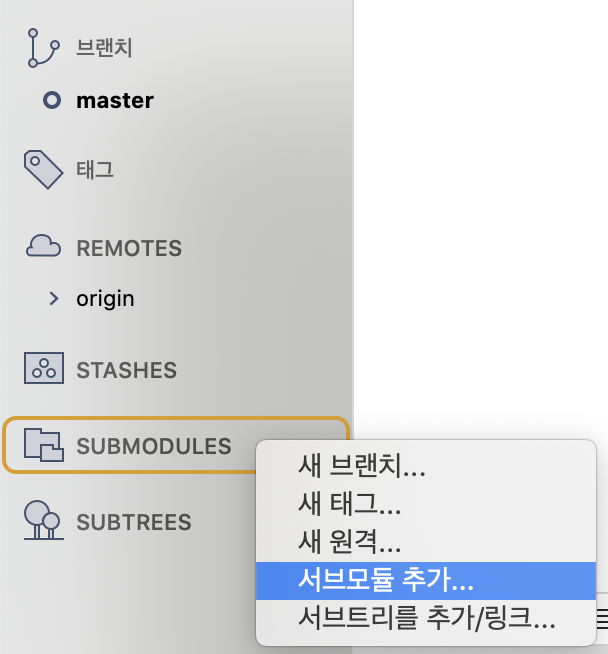

**'git submodule add {서브모듈 Git 주소}'**를 하면  **.gitmodules** 파일이 생성되고 해당 경로에 submodule 파일들이 fetch 됩니다.

예시의 경우 최상단에 **TestSubmodule**을 추가하였습니다.

**.gitmodules** 파일에는 프로젝트에 포함되어 있는 서브모듈에 대한 정보가 들어있습니다.

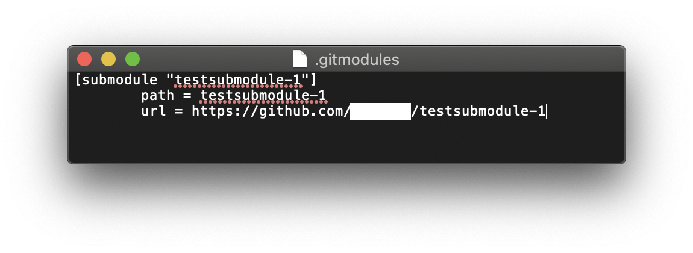

Git 클라이언트에서도 잘 표시되는군요.!

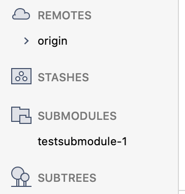

이제 서브모듈을 불러왔으니 **TestApp1** 프로젝트를 열어서 **TestSubmodule** 모듈을 추가해주어야 합니다.

**TestApp1** 프로젝트의 **Target** -> **Frameworks '+'** \-> **Add Other...** -> **Add Files...** -> **TestSubmodule.xcodeproj** click

워크스페이스에 추가가 안되어있어서 + 를 눌러도 바로 뜨진 않습니다. Add Other를 해서 추가를 합니다.

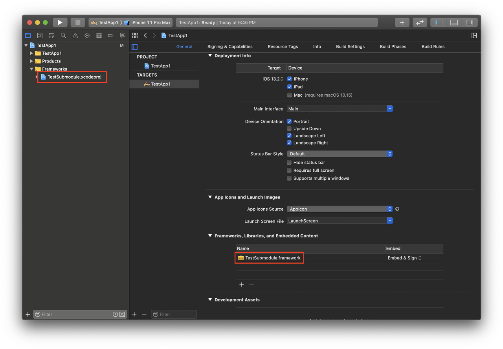

자. 위 순서로 추가하고 나니 Project navigator에 자동으로 Frameworks 폴더가 추가되고 TestSubmodule 프로젝트도 추가되었습니다.!

추가하는 건 아주 간단하게 끝났습니다.

---

이번엔 **서브모듈의 코드를 변경**하고 **메인 프로젝트에서 서브모듈의 변경사항을 가져와서 반영하는 것**을 해보겠습니다.

우선 전 **TestSubmodule** 프로젝트를 열었습니다. 그리고 코드를 추가합니다.

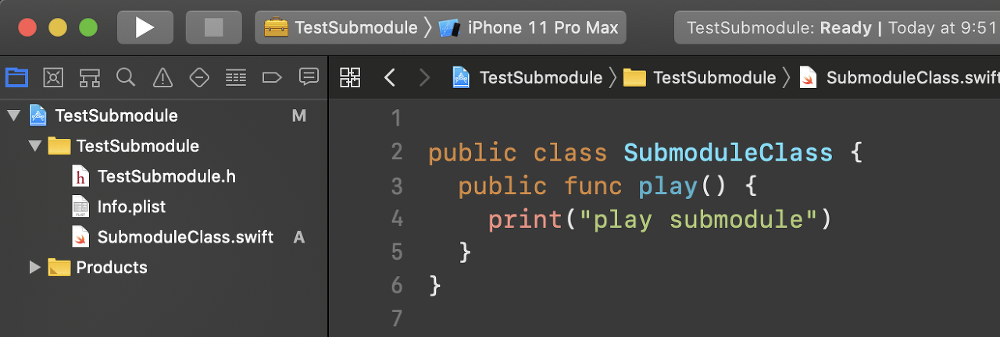

간단하게 클래스를 추가하고 변경사항을 커밋하고 푸시를 해줍시다.

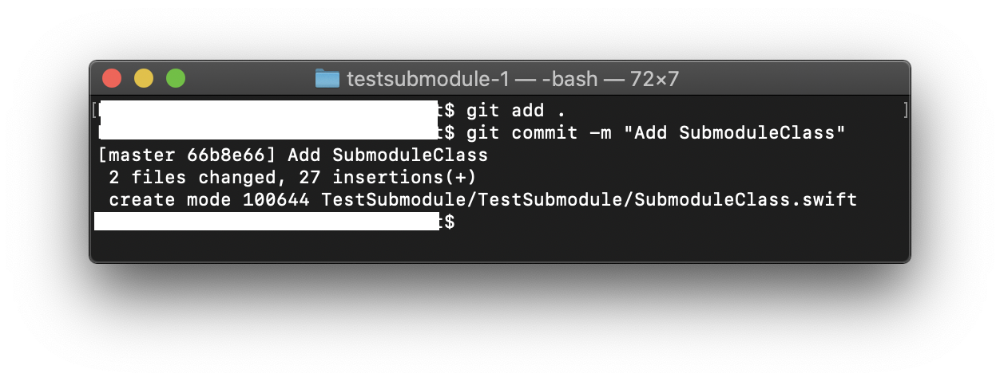

푸시를 하고 나면 TestApp1 내의 TestSubmodule에서 변경사항이 있다는 알림을 받습니다.

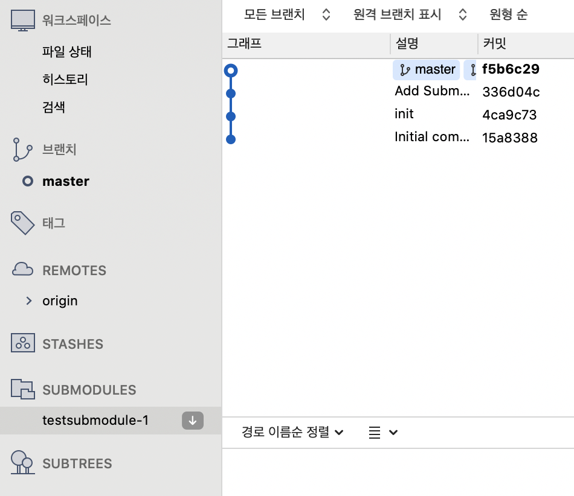

**TestSubmodule**의 Git. 그러니까 메인 프로젝트 안에 있는 서브모듈로 이동해서 Pull을 해야 합니다. 그야 당연하겠죠? 우린 서브모듈로 추가하긴 했지만 fork를 해서 코드를 집어넣은 것과 별반 차이 없습니다.

서브모듈에서 Pull을 하셨나요? 이제 메인 프로젝트로 다시 이동하면.! 이렇게 서브모듈의 변경사항이 나타납니다.

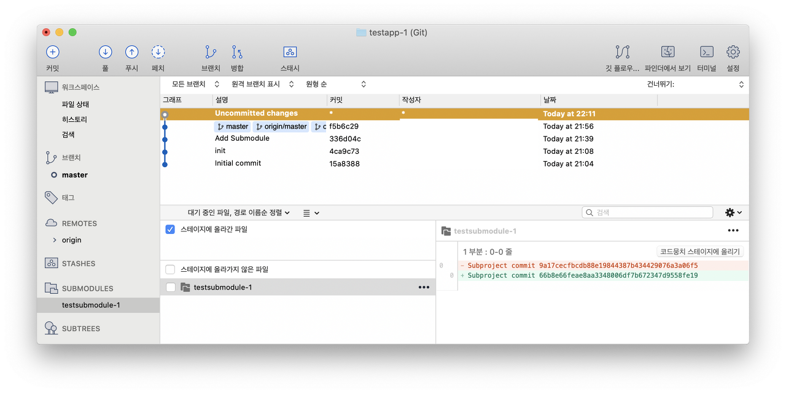

신기한 건, 분명 코드가 포함되어 있음에도 코드 변경사항은 포함되지 않습니다. 다만 메인 프로젝트에서 포함하고 있는 서브모듈의 **commit(hash)**만 저장됩니다.!

서브모듈을 변경하고 원격 저장소 반영, 메인 프로젝트에 반영하는 것 까지 해보았습니다. 음.. 괜찮은 지 사실 잘 모르겠어요. Cocoapods으로 관리할 때랑 비교를 해볼까요?

---

### 서브모듈 변경사항 트래킹

**Cocoapods**

1\. 서브모듈 코드를 수정한다.  
2\. 서브모듈의 변경사항을 원격 저장소에 push  
3\. 메인 프로젝트에서 podfile을 수정한다.(필요한 경우)  
4\. 메인 프로젝트에서 pod update

**Git Submodule (서브모듈 프로젝트를 직접 열어서 수정한 경우)**

1\. 서브모듈 코드를 수정한다.  
2\. 서브모듈 변경사항을 원격 저장소에 push  
3\. 메인 프로젝트 안에 있는 서브모듈의 변경사항을 pull  
4\. 메인 프로젝트 변경사항(서브모듈 업데이트)을 원격 저장소에 push

**Git Submodule (메인 프로젝트를 열어서 서브모듈을 수정한 경우)**

1\. 서브모듈 코드를 수정한다.  
2\. 서브모듈 변경사항을 원격 저장소에 push  
3\. 메인 프로젝트 변경사항(서브모듈 업데이트)을 원격 저장소에 push

---

### 장점

바로 위에서 언급한 마지막 케이스!

앱 프로젝트를 열어 작업을 하다가 공통모듈에 변경이 필요한 경우 코드를 **내 프로젝트에서 수정하고 바로 공통모듈의 리모트에 적용**할 수 있습니다. 이것 자체 Pod에 비해 엄청난 장점! 꿀!

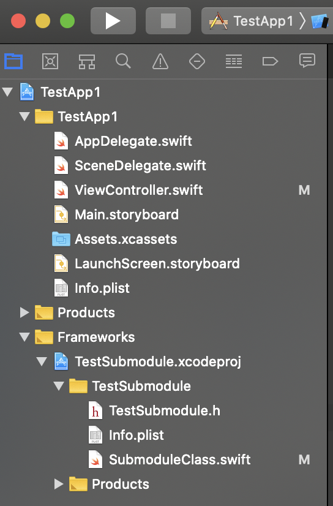

### 단점

서브모듈에 변경사항이 있으면 서브모듈의 git pull을 하는 건 뭐 서로 다른 Git이니 당연한 거지만,

서브모듈이 **하나가 아니라 여~~ 러 개**가 포함되어있고 한 번에 모두 업데이트되었을 때 과연 메인 프로젝트에서 서브모듈을 모두 업데이트 치는 게 편할까?

**서브모듈 하나하나 들어가서 pull**을 해야 하는 상황이 온다면 생각보다 끔찍합니다.

**'git submodule foreach'**라는 명령어가 있습니다. 각 서브모듈에 Git 명령을 한 번에 내리는 것인데 만약 동일한 이름의 특정 브랜치에서 일괄 pull을 받는다면, 쓸 수도 있을 듯합니다. (소스트리는 해당 기능에 대한 gui는 없는 듯..)

하나의 워크스페이스에 여러 프로젝트가 있을 때 생기는 문제.. 😩 **Build Configuration** !

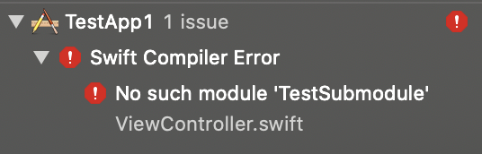

프로젝트를 빌드할 때 **Build Configuration** 이름이 다르면 빌드 패스가 달라져서 Framework 링크를 거는 과정에서 해당 모듈을 못 찾는 문제가 발생합니다.

이거 생각보다 골치... 스크립트로 해결하는 방법이 있는걸로 아는데, 명확한 해결책을 찾진 못했습니다.

프로덕트 레벨에서 적용하려면 많은 dry run이 필요할 듯 하네요.