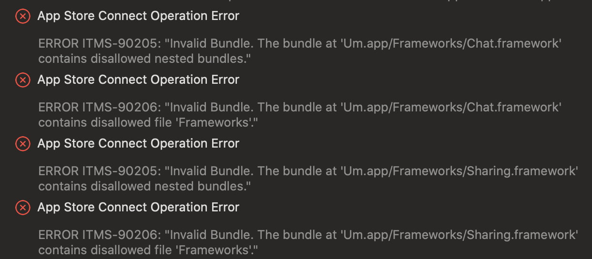
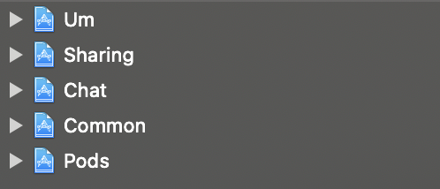

앱스토어에 앱을 등록하기 위해 업로드하던 도중 이런 에러가 발생했다.



종류는 두 가지였는데 

**ITMS-90205: Invalid Bundle contains disallowed nested bundles**<br/>
**ITMS-90206: Invalid Bundle contains disallowed file 'Frameworks'**

이번 경우에는 번들링 하는 과정에서 번들이 중복으로 여러 번 포함되는 문제였다. 



두 가지 정도의 해결책이 있었다. 프로젝트에 존재하는 프레임워크들의 Linking Mach-O Type을 Static Library로 모두 변경하거나 아래처럼 빌드 단계에 아래의 스크립트를 추가하는 것이다.

앱 컨테이너 역할, 그러니까 AppDelegate가 존재하는 프로젝트를 제외한 나머지 프로젝트에 모두 이 스크립트를 추가해서 중복으로 추가되는 프레임워크를 제외시킨다.

```ruby
cd "${CONFIGURATION_BUILD_DIR}/${UNLOCALIZED_RESOURCES_FOLDER_PATH}/"
if [[ -d "Frameworks" ]]; then 
    rm -fr Frameworks
fi
```