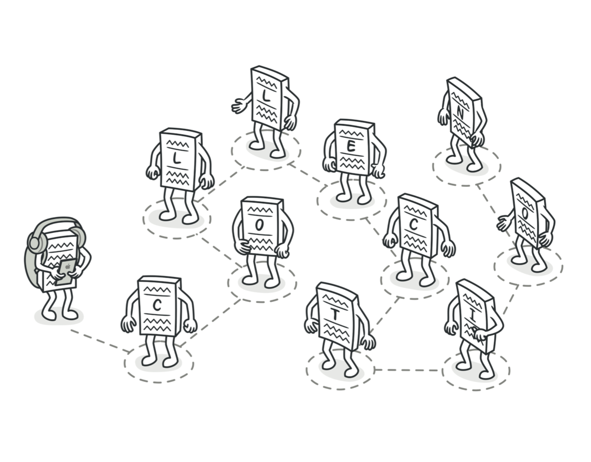
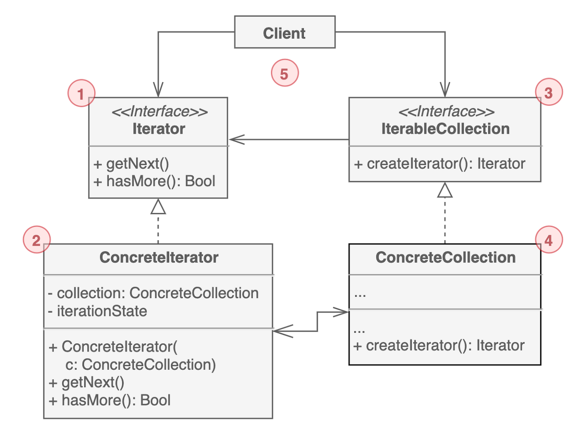

# 반복자 패턴

반복자는 데이터의 타입(리스트, 스택, 트리 등)을 드러내지 않고 컬렉션 요소를 순회할 수 있는 행동 디자인 패턴이다.

컬렉션은 데이터 집합이 되는 자료구조이자 굉장히 많이 사용하는 데이터 타입이다. 간단한 리스트나 상대적으로 복잡한 스택, 트리, 그래프 모두 여기에 속한다. 컬렉션에서 데이터를 저장하는 것만큼 중요한 것이 각 요소들에 액세스 하는 것이다. 동일한 요소에 반복해서 접근하지 않고 모든 요소를 거치는 방법이 필요하다.

리스트에서는 쉬운 작업일 수도 있다. 하지만 트리나 그래프같은 다소 복잡한 자료구조에서는 분명 이전과는 다른 순회 방식이 필요하다.

반복자 패턴의 주요 아이디어는 컬렉션의 순회 동작을 별도의 반복자 객체로 분리하는 것이다. 반복자 객체는 알고리즘을 구현할뿐만 아니라 현재 위치나 남은 요소 등 모든 순회 세부 사항을 캡슐화한다. 이 덕분에 여러 반복자가 동일한 컬렉션을 서로 독립적으로 순회할 수 있게 되는 것이다.

## 구조

1. 컬렉션 `탐색에 필요한 메서드를 선언`한다.

2. 컬렉션 `순회`를 위한 특정 알고리즘을 구현한다. 반복자 객체는 자체적으로 순회 진행상태에 대한 정보를 관리해야 한다.

3. 컬렉션 인터페이스는 반복자와 상호작용을 위한 메서드를 정의한다. 구체 컬렉션이 다양한 반복자를 반환할 수 있도록 리턴 타입을 인터페이스로 선언한다.

4. 구체 컬렉션은 클라이언트가 요청할 때 마다 `특정 반복자 인스턴스를 반환`한다. 

5. 반복자와 컬렉션 인터페이스를 사용한다. 구체 클래스와 연결되지 않으므로 동일한 클라이언트 코드로 다양한 컬렉션이나 반복자에 동일하게 사용할 수 있다.

## 예제 코드