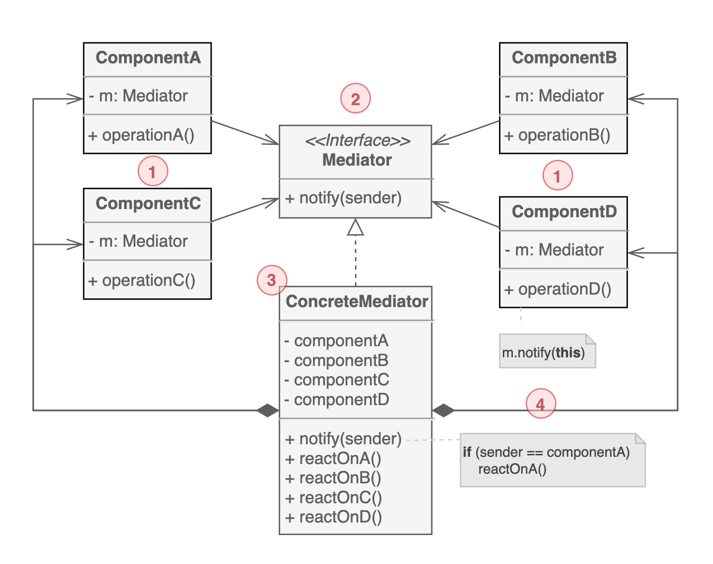

# 중재자 패턴

복잡한 의존 관계를 줄이고자 할 때 유용한 행동 디자인 패턴이다. 이 패턴은 특정 객체 간에 직접 통신을 제한하고 중재자 객체를 통해서만 통신하게 된다.

## 구조

1. `비즈니스 로직`을 포함하는 여러 클래스들이다. 중재자 인터페이스에 대한 참조를 갖고 있다.

2. `컴포넌트와 통신하기 위한 메서드를 선언`하며 일반적으로 notify 메서드를 하나 포함한다. 컴포넌트는 이 메서드에 자신을 포함한 컨텍스트를 메서드의 인자로 전달할 수 있지만 수신 컴포넌트와 커플링이 발생하지 않는 방식으로만 전달할 수 있다.

3. 구체 중재자는 `컴포넌트 간의 관계를 캡슐화`한다. 종종 모든 컴포넌트에 대한 참조를 갖고 있기도 하고 수명주기를 관리한다.

4. 하나의 컴포넌트는 다른 컴포넌트의 존재를 알지 못하고, 이벤트가 발생하면 `중재자에게 모든 메시지를 전달`한다.

## 예제 코드