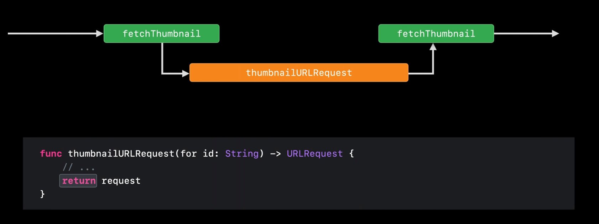
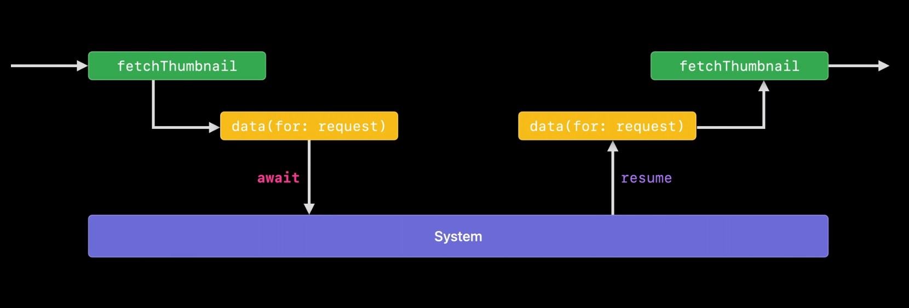

스위프트로 개발하면 많은 비동기 코드를 다루게 되지만, 클로저나 Completion Handler로 구성된 API들이 다루기 까다로운 것은 사실이다. 특히나 로직이 조금 복잡해지거나 에러 처리가 필요한 시점이 되면 문제가 발생한다. 이러한 이유로 스위프트 5.5에도 [코루틴](https://en.wikipedia.org/wiki/Coroutine) 모델이 도입되었다. 함수 자체를 비동기로 선언할 수 있고, 프로퍼티도 비동기 접근이 가능하다. 이제 다른 비동기 메커니즘을 도입하지 않고, 순수 스위프트만으로도 구조화된 비동기 코드를 작성하는 게 가능하지 않을까 생각한다.

## Completion
스위프트에는 비동기를 처리하기 위한 여러 방법들이 있다. 그중에서도 일반적으로 많이 사용하는 방식이 `완료 핸들러`를 사용하는 방식이다.

```swift
func fetchThumbnail(for id: String, completion: @escaping (UIImage?, Error?) -> Void)
```
이 함수가 동기식으로 동작을 한다면 곧바로 결과를 반환하면 되기 때문에 completion은 쓰지 않을 것이다. 하지만 비동기로 동작하기 때문에 `fetchThumbnail`의 작업이 완료되었을 때 caller에게 결과를 돌려주기 위해 completion을 인자로 전달받았다.

```swift
func fetchThumbnail(for id: String, completion: @escaping (UIImage?, Error?) -> Void) {
  let request = thumbnailURLRequest(for: id)
  let task = URLSession.shared.dataTask(with: request) { data, response, error in
    if let error = error {
      completion(nil, error)
    } else if (response as? HTTPURLResponse)?.statusCode != 200 {
      completion(nil, FetchError.badID)
    } else {
      guard let image = UIImage(data: data!) else {
        return
      }
      image.prepareThumbnail(of: CGSize(width: 40, height: 40)) { thumbnail in
        guard let thumbnail = thumbnail else {
          return
        }
        completion(thumbnail, nil)
      }
    }
  }
  task.resume()
}
```
id를 인자로 전달받아서 이미지 데이터를 불러온 뒤 UIImage로 변환하는 작업까지 수행하는 함수이다. 간단한 동작을 수행하는 코드이지만, 이 짧은 코드에서 completion의 여러 가지 문제점을 발견할 수 있다.

completion은 비동기 콜백을 위해 사용하지만 단순히 클로저에 지나지 않는다. 그 말은 fetchThumbnail 안에서 `completion이 반드시 불린다고 보장하지 않는다`는 것이다. 위 예제에서도 두 군데의 return 문이 있는데, 이곳에서 completion 호출을 하지 않았다. 스위프트에서는 인자로 받은 completion의 호출을 보장할 방법이 없다. 그렇기 때문에 예제와 같은 `Human error가 발생`하게 된다.

명백하게 completion이 호출되게 짰다고 하더라도 군데군데 들어가있는 completion(..)은 동작을 추적하기 어렵게 만들고, 언제든 버그가 생길 수 있는 여지를 준다.

# Async/Await

위와 동일하게, 이미지 데이터를 불러온 뒤 UIImage로 변환하는 작업을 이번에는 `async`를 사용했다.

```swift
func fetchThumbnail(for id: String) async throws -> UIImage
```

가장 눈에 띄는 차이점은 completion이 사라지고 리턴 타입이 추가된 것이다. 이미지를 불러오는 데 성공하면 UIImage를 반환할 것이고, 실패한다면 에러를 던진다.

```swift
func fetchThumbnail(for id: String) async throws -> UIImage {
  let request = thumbnailURLRequest(for: id)
  let (data, response) = try await URLSession.shared.data(for: request)
  guard (response as? HTTPURLResponse)?.statusCode == 200 else { throw FetchError.badID }
  ...
}
```

`URLSession.shared.data`는 위에서 보았던 `dataTask`와는 다르게 `awaitable`하다. 간단하게 비동기 함수를 호출할 수 있고, 스레드가 블로킹되지 않는다.

async/await의 관계는 throws/try 관계와 동일하게 동작한다. `throws로 선언된 함수를 호출할 때에는 try를 호출 앞에 선언`해줘야 하는 것처럼, `async로 선언된 함수를 호출할 때에는 await를 선언`해 주어야 한다.

```swift
func fetchThumbnail(for id: String) async throws -> UIImage {
  let request = thumbnailURLRequest(for: id)
  let (data, response) = try await URLSession.shared.data(for: request)
  guard (response as? HTTPURLResponse)?.statusCode == 200 else { throw FetchError.badID }
  let maybeImage = UIImage(data: data)
  guard let thumbnail = await maybeImage?.thumbnail else { throw FetchError.badImage }
  return thumbnail
}
```

completion 버전과는 대조적으로 위 방법은 에러를 던지거나 값을 반환하는 것을 보장하고 보기에도 훨씬 간결하다.

## Async properties

위 예제의 마지막 줄에 나타난 것처럼 `maybeImage`의 `thumbnail` 프로퍼티에 접근할 때에도 await를 선언하고 있다. async는 `function`뿐만 아니라 `property`, `initializer`에서도 제공한다.

```swift
extension UIImage {
  var thumbnail: UIImage? {
    get async {
      let size = CGSize(width)
      return await self.byPreparingThumbnail(ofSize: size)
    }
  }
}
```

`async 프로퍼티`의 2가지 특징이 있다. 
1. `명시적인 getter`가 필요하다. 그리고 Swift 5.5를 기점으로 getter에서 throw가 가능해졌고, `async throws` 순으로 사용한다.
2. `Read-only` 프로퍼티만 async로 선언할 수 있다.

## Async sequences

```swift
for await id in staticImageIDsURL.lines {
  let thumbnail = await fetchThumbnail(for: id)
  collage.add(thumbnail)
}
let result = await collage.draw()
```

[Sequence](https://developer.apple.com/documentation/swift/sequence)에서도 `await`를 사용할 수 있다. for loop이 비동기로 동작하고 있다면 `element 앞에 await를 선언`해야 한다. 함수가 비동기 시퀀스를 통해서 반복될 때, 다음 요소를 기다리는 동안 스레드를 블로킹하지 않고 기다렸다가 다음 요소가 오면 다시 함수를 시작한다.

- `비동기 시퀀스`를 더 자세히 알고 싶다면 [Meet AsyncSequence]()
- `병렬로 수행하는 비동기`를 더 알고 싶다면 [Structured concurrency in Swift](https://developer.apple.com/videos/play/wwdc2021/10134/)

## How does async/await work? 

### A normal function call
`thumbnailURLRequest`처럼 일반적인 함수는 실행되는 동안 스레드의 제어권을 얻게 되고, 함수가 완료될 때까지 스레드를 완전히 쥐게 된다. 함수는 에러를 던지거나 값을 반환하면서 완료될 수 있는데, 이때 스레드에 대한 제어권도 넘기게 된다.



하지만 일반적인 함수와 달리 함수가 완전히 종료되지 않은 체 제어권을 넘길 수 있는 방법이 Suspend이다.

---

### An asynchronous function call

일반 함수처럼 비동기 함수 또한 호출할 때 스레드에 대한 제어권을 얻게 된다. `비동기 함수는 실행 중에 스레드에 대한 제어를 시스템에 넘길 수 있다.` 그리고 시스템에 의해 다시 함수가 실행이 되고 작업을 이어가게 된다.



하지만 모든 비동기 함수가 반드시 일시 중단(suspend) 되는 것은 아니다. `await`가 있다고 해서 `반드시 일시 중단 되는 것은 아니다`는 의미이다.

### async/await 의 몇 가지 중요한 사실들

1. `async` 선언은 해당 함수가 `일시 중단될 수 있음`을 말한다. 그리고 해당 함수가 일시 중단되면 호출자도 일시 중단 된다. 따라서 `호출자도 비동기`여야 한다.
2. 비동기 함수에서 `일시 중단될 수 있는 위치`를 가리키기 위해 `await`를 사용한다.
3. 함수가 일시 중단된다고 스레드가 블로킹 되는 것은 아니다.


## References

- [Meet async/await in Swift](https://developer.apple.com/videos/play/wwdc2021/10132/)
- [SE-0296: Async/await](https://github.com/apple/swift-evolution/blob/main/proposals/0296-async-await.md)
