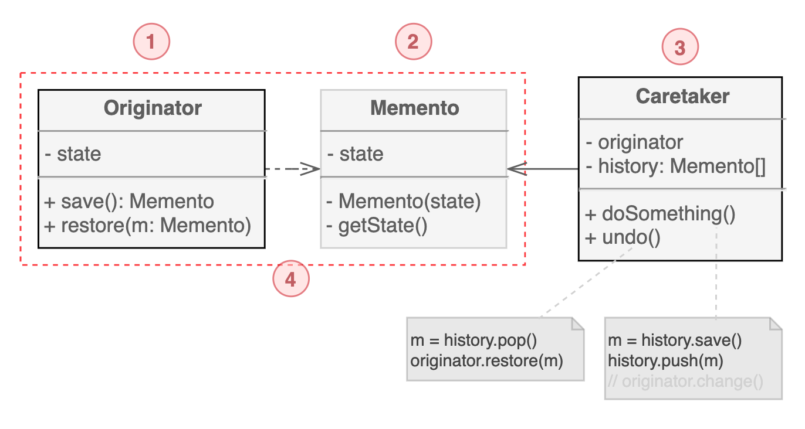
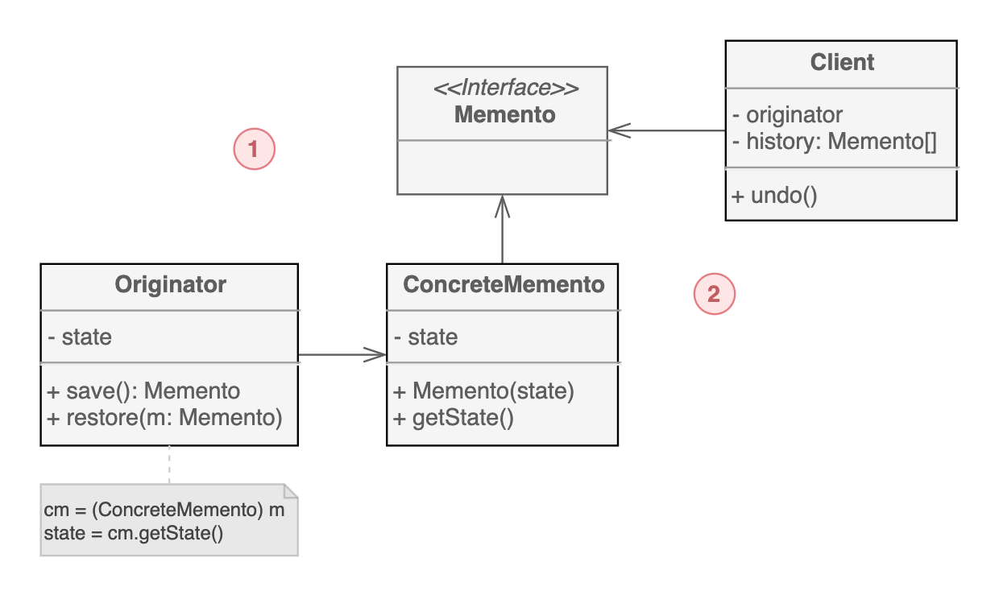

# 메멘토 패턴

메멘토 패턴은 `객체의 상태를 저장하고 복원할 수 있는` 행동 디자인 패턴이다. 구현 세부 사항은 외부로 드러내지 않는다.

## 구조

#### 중첩 클래스 기반 구현

1. 자신의 `스냅샷을 생성`하고 필요할 때 `상태를 저장`하고 `복원`할 수 있다. 

2. Originator 상태의 스냅샷 역할을 하는 `값 객체`이다. 메멘토를 불변으로 만들고 생성자를 통해 데이터를 한 번만 전달하는 것이 일반적이다.

3. Originator의 상태를 언제, 왜 저장해야 하는지와 복원 시점을 알고 있다. 스냅샷 더미를 저장해서 Originator의 히스토리 이력을 추적할 수 있다. 과거 스냅샷으로 돌아가야 하는 경우 최상위 스냅샷을 가져와서 Originator를 복원한다.

4. 이 구현 방식에서 Memento 클래스는 Originator 내부에 위치한다. 그렇기 때문에 Memento의 필드나 메서드가 private으로 선언된 경우에도 접근할 수 있다. 반면에 Caretaker는 Memento에 대한 접근이 제한적이어서 상태 저장은 하지만 변경을 하지는 않는다.

#### 중간 인터페이스를 둔 구현

중첩 클래스를 지원하는 않는 언어에서 구현할 수 있는 방법.

1. 중첩 클래스를 사용할 수 없는 경우, Caretaker는 명시적으로 선언된 인터페이스를 통해서만 메멘토와 대화를 할 수 있다.

2. Originator는 Memento 클래스에 선언된 필드나 메서드에 직접 접근할 수 있다. 유일한 단점은 Memento 클래스의 모든 멤버를 public으로 선언해야 한다는 것이다.

## 예제 코드