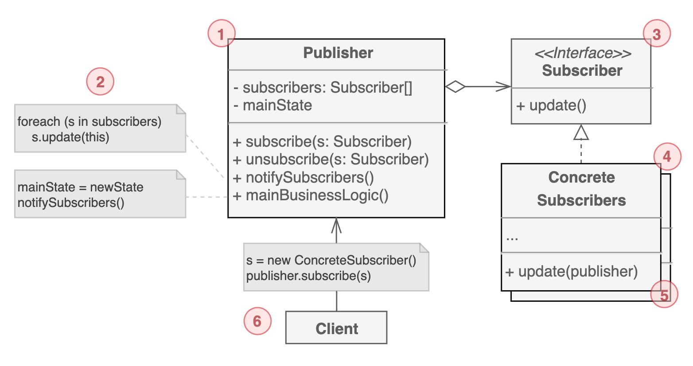

# 옵저버 패턴

특정 객체에서 발생하는 `이벤트를 구독자에게 전달하는 발행-구독 메커니즘`이다. 구독자는 여러 객체가 될 수 있다.

옵저버의 핵심은 나에게 필요한 정보를 내가 매번 확인하는 것이 아니라, 정보 생산자에게 알려달라고 부탁하는 것이다. 

옵저버 패턴에서는 우리가 관심이 있는 대상을 `주제`라고도 하지만 상태변화에 대한 정보를 다른 객체들에게 전달하기 때문에 `발행자`라고도 부른다. 발행자의 상태 변화를 추적하는 다른 객체를 `구독자`라고 한다.

## 구조

1. 다른 객체가 구독 중인 `이벤트를 발행`한다. 이러한 이벤트는 발행자가 상태를 변경하거나 특정 동작을 수행할 때 발행한다. 발행자는 현재 구독자 정보, 신규 구독 및 구독 해제를 관리한다. 

2. 이벤트가 발생하면 발행자는 `모든 구독자`에게 `알림 메시지를 전달`한다.

3. `이벤트 정보 수신`을 위한 `인터페이스`를 정의한다. 대부분의 경우엔 update 메서드 하나만 있고, 파라미터로 이벤트의 상세 정보를 전달하는 방식이다.

4. 발행자의 이벤트를 받는 대상이다. `이벤트를 처리`한다.

5. 일반적으로 구독자가 이벤트를 제대로 처리하려면 컨텍스트 정보를 필요로 할 때가 있다. 그렇기 때문에 발행자 쪽에서 이벤트를 전달할 때 컨텍스트 정보를 종종 같이 전달한다.

6. 발행자와 구독자 객체를 만든 다음에 발행 이벤트에 대한 구독자를 등록한다.

## 예제 코드
