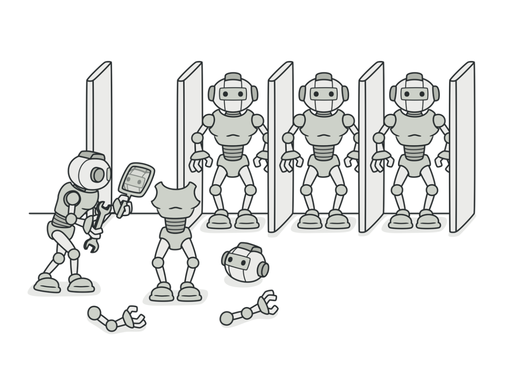

# 프로토타입 패턴

프로토타입 패턴은 원형이 되는 인스턴스를 사용하여 생성할 객체의 종류를 명시하고, 이렇게 만든 견본을 복사해서 새롭게 객체를 생성합니다.

프로토타입 클래스에는 구체 클래스를 알 수 없는 경우에도 객체를 복사할 수 있는 공통된 인터페이스를 제공합니다. 동일한 클래스의 객체는 내부 프로퍼티를 모두 알 수 있으므로 프로토타입 객체는 전체 복사본을 생성할 수 있습니다.

## 예제 코드

#### Prototype (Layer)

```swift

protocol Drawable {
    func draw()
}

protocol Cloneable: NSCopying {
    func copy() -> Self?
}

extension Cloneable {
    func copy() -> Self? {
        copy(with: nil) as? Self
    }
}

protocol Layer: Drawable, Cloneable {}
```
자신을 복제하는 데 필요한 인터페이스를 정의합니다.

#### ConcretePrototype (CircleLayer)

```swift

class CircleLayer: Layer {

    private var rect: CGRect
    private var radius: CGFloat

    init(rect: CGRect, radius: CGFloat) {
        self.rect = rect
        self.radius = radius
    }

    func copy(with zone: NSZone? = nil) -> Any {
        CircleLayer(rect: rect, radius: radius)
    }

    func draw() {
        //
    }
}
```
자신을 복제하는 연산(copy)을 구현합니다.

#### Client (DrawingTool)

```swift

class DrawingTool {

    func drawWithCopy(from layer: Layer) {
        let newLayer = layer.copy()
        newLayer?.draw()
    }
}
```
복제를 요청하고 새로운 객체를 생성합니다.
