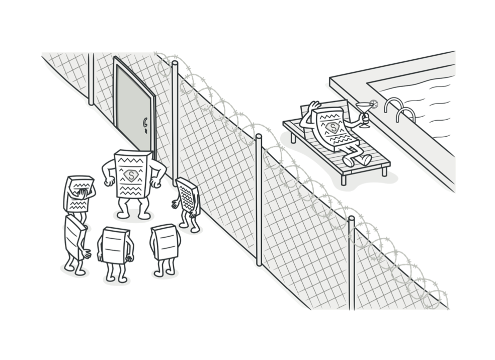
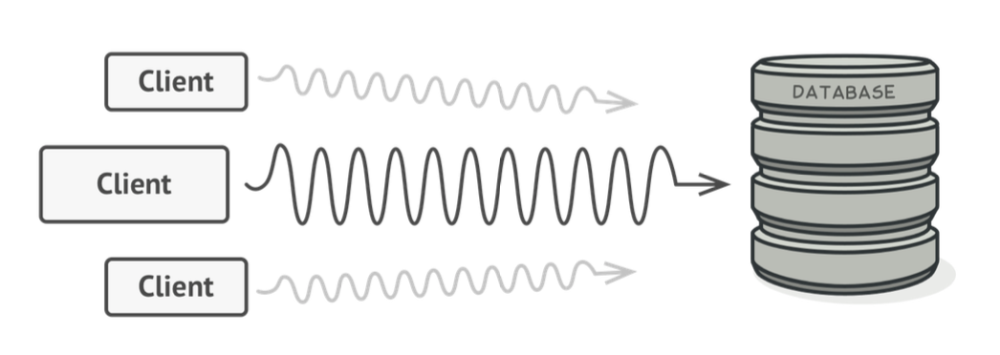
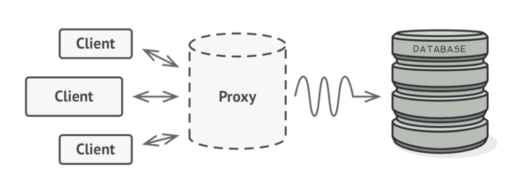
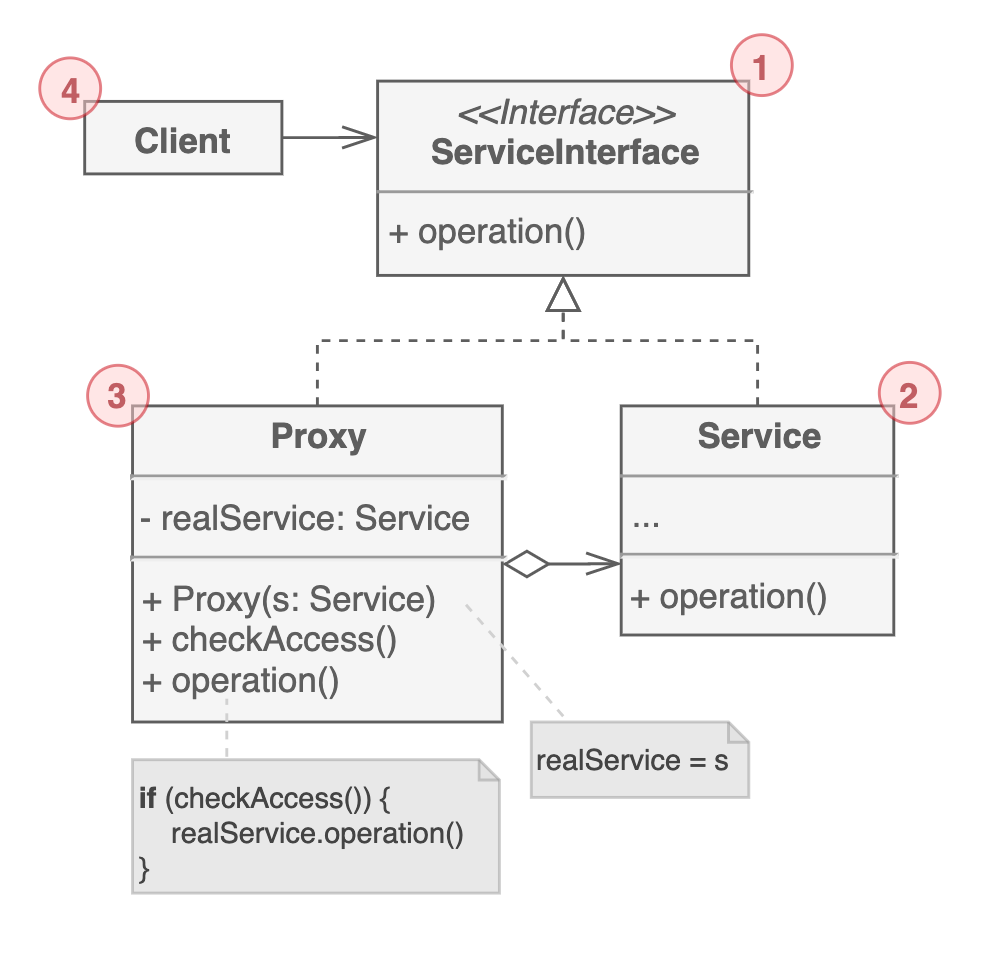

# 프록시 패턴

다른 객체의 역할을 대신 수행할 때 사용하는 구조 패턴이다. 기존 객체에 대한 접근을 제어하고, 요청을 보내기 전이나 후에 다른 동작을 수행할 수도 있다.

애플리케이션에는 많은 리소스를 차지하는 거대한 객체가 있을 수 있다. 대표적인 것이 데이터베이스이다. 데이터베이스 커넥트는 많은 리소스를 차지하는데다가 쿼리 속도 또한 다른 동작에 비해 상대적으로 많이 느린편이다.

객체를 생성하고 유지하는 비용이 상당할 때 흔히 쓰는 방법이 지연 초기화를 사용하는 것이다. 미리 생성하는 것이 아니라 필요할 때 추가적으로 생성하는 것이다. 그런 역할을 일부 수행하는 것이 프록시다.

프록시 패턴은 기존 서비스 객체와 동일한 인터페이스를 사용해서 새 프록시 클래스를 만든다. 그렇기 때문에 클라이언트 코드의 변경 없이 서비스 실행 로직 전후에 새로운 동작을 추가할 수 있다는 장점이 있다.

## 구조

1. 서비스의 인터페이스. 프록시도 이 인터페이스를 따른다.

2. `비즈니스 로직`이 담긴 서비스 클래스이다.

3. 서비스 객체에 대한 참조를 갖고 있다. 서비스 객체로 `요청을 보내기 전에 초기화, 로깅, 캐싱 등등의 처리를 수행`한다. 일반적으로 `서비스 객체의 수명주기를 관리`한다.

4. 클라이언트는 동일한 인터페이스를 통해 서비스와 프록시 모두랑 동작한다. 서비스 객체가 필요한 모든 곳에 `프록시로 대체 가능`하다.

## 예제 코드