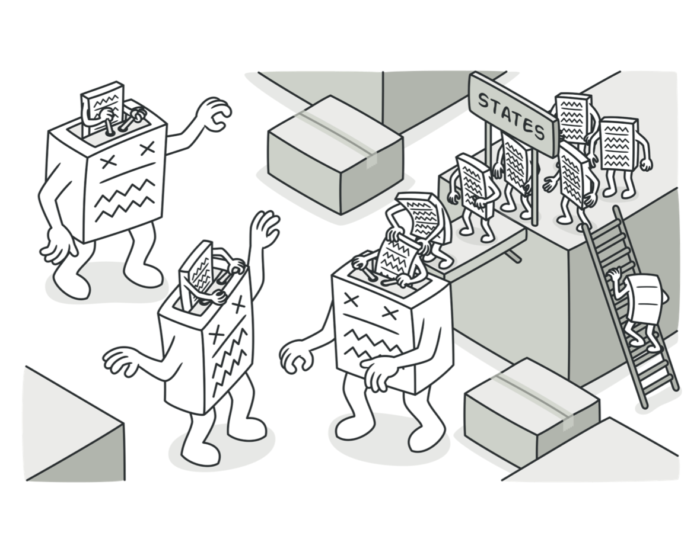
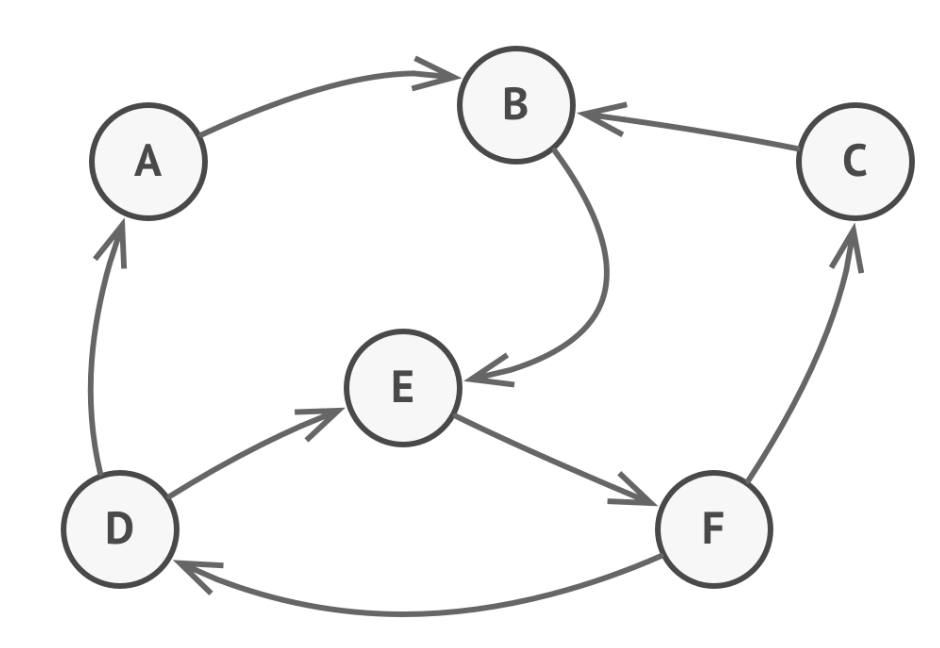
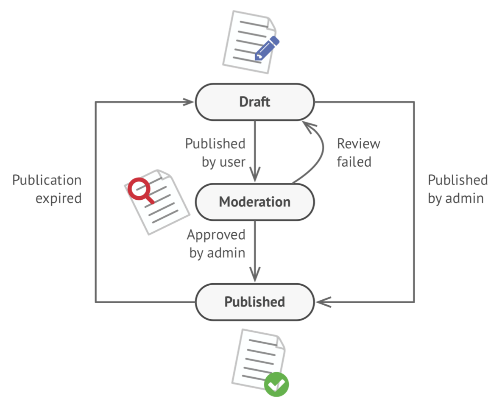
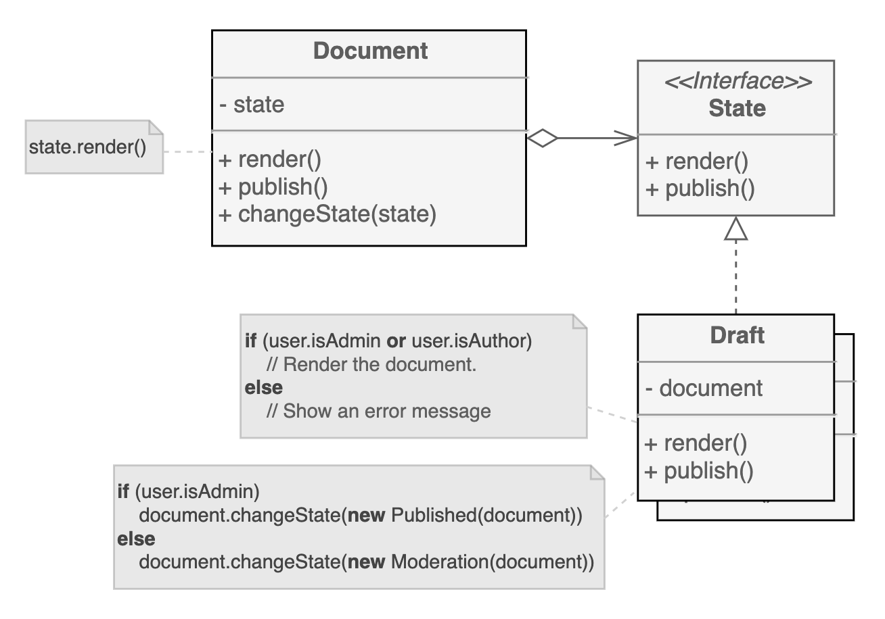
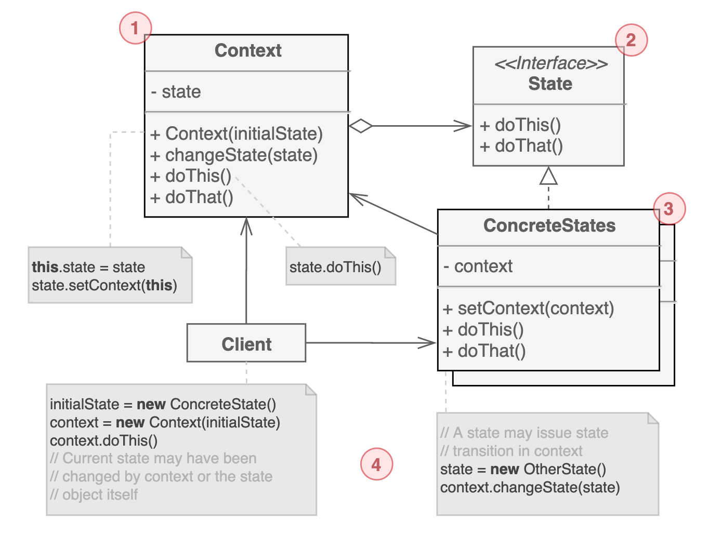

# 상태 패턴

객체 내부 상태의 변화에 따라 행동을 바꾸도록 하는 행동 디자인 패턴이다. 상태 패턴은 유한 상태 머신과도 밀접한 관련이 있다.



주요 아이디어는, 어떤 순간에도 프로그램에 존재하는 상태의 수가 한정되어 있다는 것에서 출발한다. 각 상태에 따라 프로그램은 동일하게 동작할 수도, 다르게 동작할 수도 있다. 그리고 하나의 상태에서 다른 상태로 바뀌는 '전환' 규칙도 유한하고 미리 정해져 있다.

이 개념을 문서 객체에 적용하면 아래처럼 된다.



문서는 3가지 상태가 존재하고, 어떤 상태에서 어떤 일이 발생하느냐에 따라 상태의 전환이 발생한다. 상태와 전환 규칙은 모두 유한개이다.

일반적으로 객체의 상태에 따라 동작하는 경우 많은 조건부 연산자로 구현하게 된다. 사실 상태 머신에 대해 모르더라도 누구나 한 번은 구현해봤을 것이다.

```swift

class Document {
    
    var state: String
    
    // ...
    
    func publish() {
        switch state {
        case "draft":
            state = "moderation"
        case "moderation":
            if currentUser.role == "admin" {
                state = "published"
            }
        case "published":
            // Do nothing
            break
        }
        // ...
    }
}
```

조건문에 기반한 상태 머신의 단점은, 상태의 수와 상태에 따른 동작이 추가될 때에 크게 드러난다. 대부분의 메서드에서 굉장히 지저분한 조건문이 들어가게 된다.

상태 패턴은 가능한 모든 상태에 대해서 클래스로 추출하는 방법을 사용한다.



전략 패턴과 굉장히 유사해 보이지만 한 가지 중요한 차이점은 상태 패턴에서 하나의 상태는 다른 상태의 존재를 알고 전환을 할 수 있지만, 전략 패턴에서는 서로에 대해 알지 못한다는 것이다.

## 구조



1. 컨텍스트는 하나의 상태를 갖고, `모든 작업을 상태 객체에게 위임`한다. 컨텍스트는 새로운 상태로 전환하기 위한 세터 메서드도 구현한다.

2. 상태 인터페이스는 상태에 필요한 메서드를 선언한다. 이 메서드는 모든 상태에 잘 맞도록 설계되어야 한다. 자칫 불리지 않는 불필요한 메서드가 될 수도 있다.

3. 각 `상태에 맞는 동작`을 구현한다. 상태별로 유사한 코드를 줄이기 위해서 추상 클래스를 둘 수 있다. 상태 객체는 컨텍스트에 대한 정보를 갖고 있어서 필요할 경우 정보를 가져올 수 있고 컨텍스트의 `상태를 전환`할 수도 있다.

4. 컨텍스트와 구체 상태 클래스 모두 컨텍스트의 상태 변환에 관여할 수 있다.

## 예제 코드