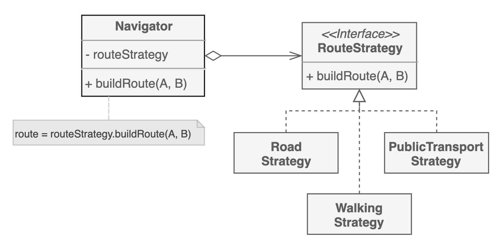
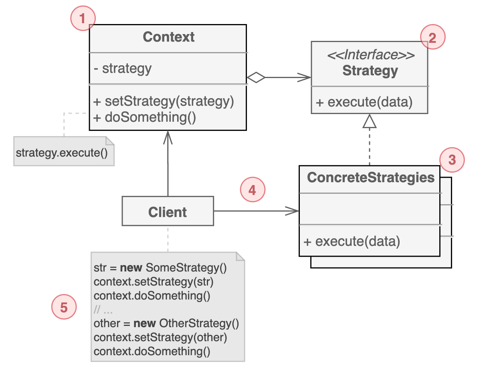

# 전략 패턴

전략 패턴은 `특정 문제에 대한 해결전략(알고리즘)을 각 클래스로 분류`하고, `해결전략 간에 상호 교체가 가능`하게 만드는 행동 디자인 패턴이다.

길찾기 알고리즘은 교통수단과 비용, 시간이라는 변수값에 따라 전략이 달라진다. 전략 패턴을 사용한다면 아래처럼 각 변수값에 따른 알고리즘을 개별적인 클래스로 분리하게 될 것이다.

## 구조

1. 전략을 가진 객체이다.

2. 구체 전략들이 가지는 공통 메서드를 정의한다.

3. 각기 다른 알고리즘으로 구현된, 동일한 기능을 수행하는 전략 클래스이다.

4. 컨텍스트는 알고리즘을 실행해야 할 때마다 연결된 전략 객체를 호출한다. 어떤 구체적인 전략으로 동작하는지, 어떻게 실행되는지는 알지 못한다.

5. 특정 전략 객체를 생성해서 컨텍스트에 전달한다. 

## 예제 코드