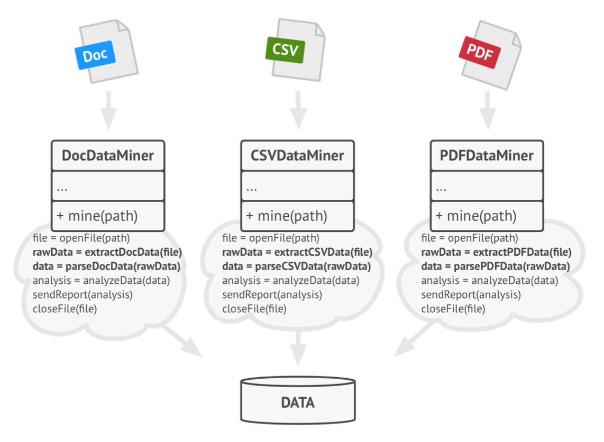
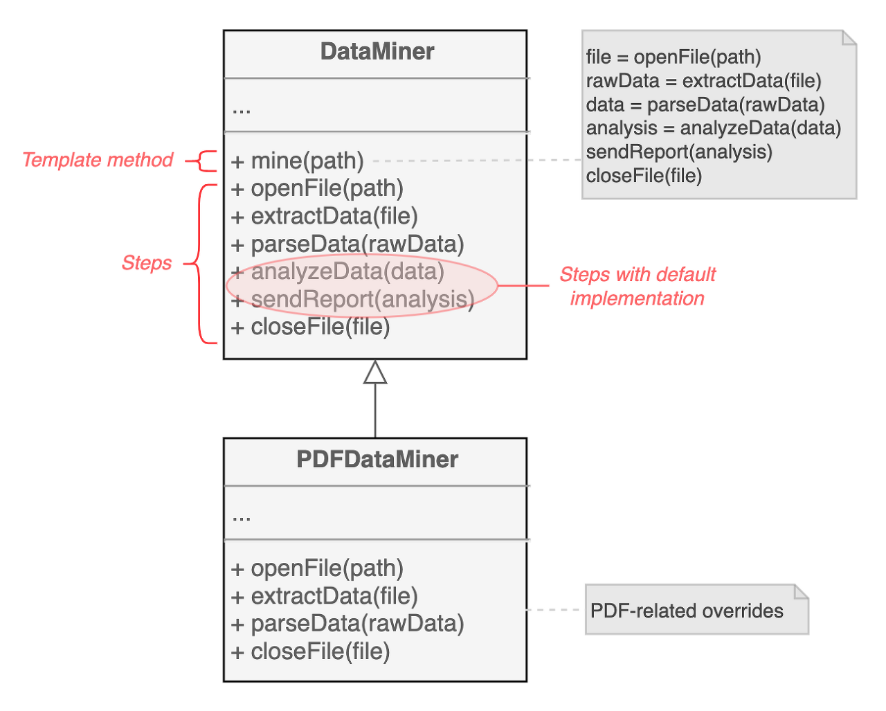
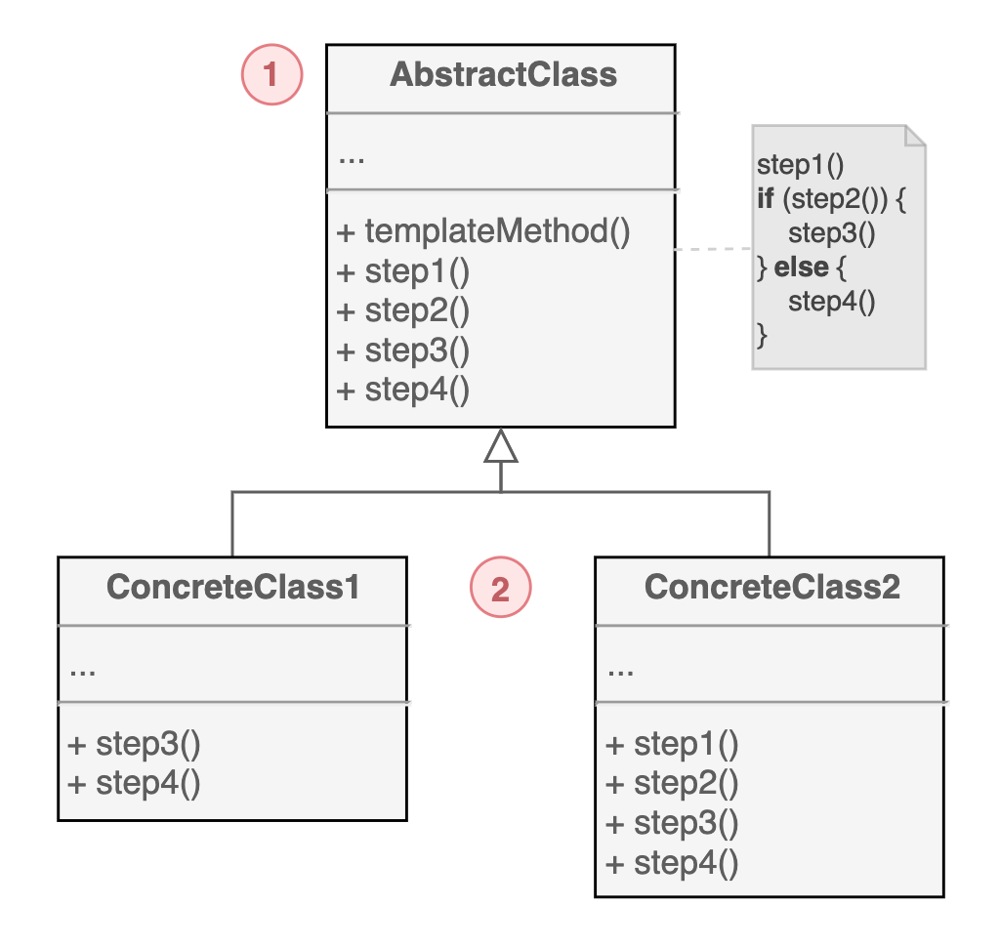

# 템플릿 메서드 패턴

알고리즘의 과정을 추상화하여 상위 클래스로 정의하고, `구조는 바꾸지 않으면서 특정 단계에서 수행하는 방법을 바꾸는` 행동 패턴이다.

Doc 포맷의 파일을 입력으로 받아 데이터 분석을 하는 애플리케이션을 만들었다고 하자. Doc 포맷만 지원했던 초기 버전에 CSV, PDF 포맷 또한 지원해야 하는 상황이 되었다. 기존의 클래스를 변경하지 않은 체 새로운 포맷에 대한 클래스를 추가하면 이처럼 구현할 수 있다.

  
이런 방식의 문제는 각 포맷을 지원하기 위한 클래스들에 굉장히 유사한 코드들이 들어가게 된다는 것이고, 실제로 동작하는 방식도 포맷별로 데이터를 얻어오는 방법만 다르고 거의 동일하다.

템플릿 메서드 패턴은 `알고리즘을 여러 단계로 세분화`하고 `단계별로 메서드를 두어서 문제를 해결`한다. 각 단계는 기본 구현을 그대로 사용할 수도 있다.

## 구조

1. 알고리즘을 단계별로 나누고 메서드로 선언한다. templateMethod()는 메서드들을 특정 순서로 호출한다.

2. 알고리즘의 모든 단계를 재정의할 수 있다.

## 예제 코드