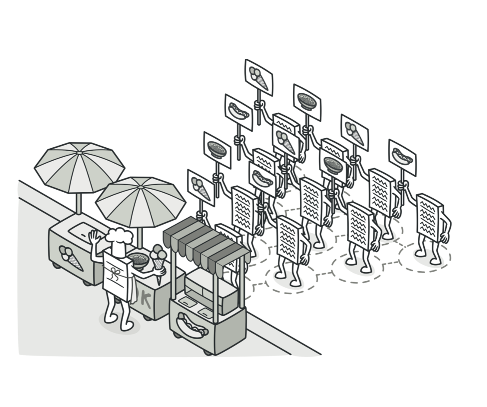
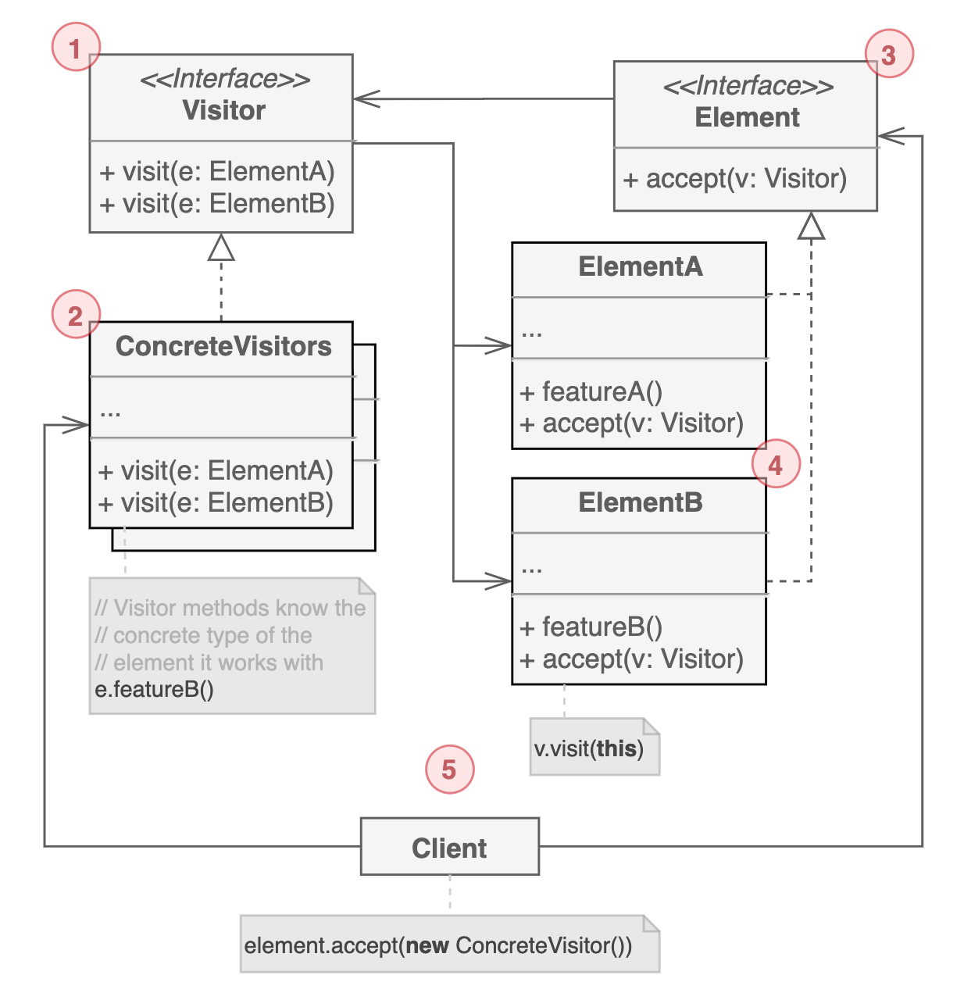

# 방문자 패턴

알고리즘과 데이터 모델을 분리시켜서 `구조를 변경하지 않고도 기존 객체에 새로운 동작을 추가`할 수 있도록 하는 행동 디자인 패턴이다.

## 구조

1. 구체 타입의 인스턴스를 인자로 받을 수 있는 함수를 선언한다. 오버로딩을 지원하는 언어라면 동일한 이름을 가질 수 있지만, 매개변수의 타입은 달라야 한다.

2. 구체 방문자 클래스는 서로 다른 Element 클래스에 맞춰 동일한 동작을 하는 여러 버전의 클래스를 구현한다.

3. 방문자 인스턴스에 대한 accepting 메서드를 정의한다. 인터페이스로 선언된 Visitor를 인자로 전달받는다.

4. 구체 Element는 accept 메서드를 구현해야 한다. 이 방법의 목적은 현재 Element 클래스에 해당하는 적절한 방문자 메서드로 리다이렉트 시키는 것이다. 기본 Element 클래스가 accept 메서드를 구현했더라도 하위 클래스에서는 반드시 이 메서드를 재정의 해야 하고 방문자 객체에서 하위 클래스를 인자로 받는 메서드를 추가로 정의해야 한다.

5. 클라이언트는 일반적으로 집합이나 복잡한 객체를 나타낸다. 대게 구체 Element를 알지는 못하지만 방문자 객체는 직접 생성한다.

## 예제 코드
